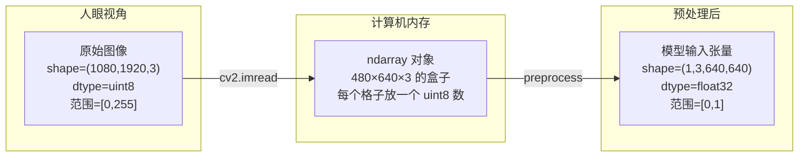

# NumPy 基础与 ndarray 详解

> 理解 `np.ndarray` —— 深度学习中最核心的数据结构。

---

## 目录

1. [ndarray 是什么](#1-ndarray-是什么)
2. [ndarray 的核心属性](#2-ndarray-的核心属性)
3. [ndarray 的创建方式](#3-ndarray-的创建方式)
4. [索引与切片](#4-索引与切片)
5. [形状操作](#5-形状操作)
6. [数据类型 dtype](#6-数据类型-dtype)
7. [图像就是 ndarray](#7-图像就是-ndarray)
8. [preprocess 函数中的 ndarray 操作](#8-preprocess-函数中的-ndarray-操作)
9. [为什么模型需要 ndarray](#9-为什么模型需要-ndarray)

---

## 1. ndarray 是什么

`np.ndarray` 是 **NumPy 的核心数据结构**，全称 **N-dimensional array**（N 维数组）。

```python
import numpy as np

# 一维数组 (向量)
a = np.array([1, 2, 3])          # shape=(3,)

# 二维数组 (矩阵)
b = np.array([[1, 2, 3],
              [4, 5, 6]])        # shape=(2, 3)

# 三维数组 (张量) — 图像最常用
c = np.zeros((480, 640, 3))      # shape=(480, 640, 3) = (H, W, C)
```

### Python list vs ndarray

```
                    Python list             NumPy ndarray
    ┌────────────────────────────────────────────────────────┐
    │ 存储方式    分散的 Python 对象       连续内存块         │
    │ 元素类型    可任意混合               统一类型           │
    │ 访问速度    慢 (指针跳转)            快 (直接偏移)      │
    │ 计算方式    Python 循环 (慢)         C 语言向量化 (快)   │
    │ 数学运算    需手动循环               a + b 直接写       │
    │ GPU 支持    不支持                   支持 (cupy/cuda)   │
    └────────────────────────────────────────────────────────┘
```

---

## 2. ndarray 的核心属性

```python
import numpy as np

# 创建一个模拟图像的三维数组
img = np.zeros((480, 640, 3), dtype=np.uint8)

print(f"ndim:     {img.ndim}")          # 3          — 维度数
print(f"shape:    {img.shape}")         # (480,640,3)— 各维度大小
print(f"dtype:    {img.dtype}")         # uint8      — 数据类型
print(f"size:     {img.size}")          # 921600     — 总元素数
print(f"itemsize: {img.itemsize}")      # 1          — 每个元素字节数
print(f"nbytes:   {img.nbytes / 1e6}MB") # 0.92 MB   — 总内存占用
```

**以三维图像为例，每个属性的含义：**

```python
img = np.array([
    [  # 第0行
        [255, 0, 0],    # 第0行第0列像素 (B,G,R)
        [0, 255, 0],    # 第0行第1列像素
        [0, 0, 255]     # 第0行第2列像素
    ],
    [  # 第1行
        [128, 128, 0],
        [0, 128, 128],
        [128, 0, 128]
    ]
])  # shape = (2, 3, 3)

#     维度0 (H) —— 2 行
#     维度1 (W) —— 3 列
#     维度2 (C) —— 3 通道 (B,G,R)
```

---

## 3. ndarray 的创建方式

```python
# 从列表创建
a = np.array([1, 2, 3])

# 全零数组
zeros = np.zeros((3, 224, 224))        # 所有元素为 0

# 全一数组
ones = np.ones((3, 224, 224))          # 所有元素为 1

# 填充指定值
full = np.full((640, 640, 3), 114)     # 所有元素为 114（灰色）

# 随机数组
random = np.random.randn(3, 224, 224)  # 标准正态分布

# 等差数列
arange = np.arange(10)                 # [0, 1, 2, ..., 9]

# 单位矩阵
eye = np.eye(3)                        # [[1,0,0],[0,1,0],[0,0,1]]
```

---

## 4. 索引与切片

### 4.1 基本索引

```python
img = np.zeros((480, 640, 3), dtype=np.uint8)

# 取单个像素
pixel = img[100, 200]         # 第100行第200列 → (3,)  [B,G,R]

# 取某一行
row = img[100]                # 第100行 → (640, 3)

# 取某一列
col = img[:, 200]             # 第200列 → (480, 3)

# 取某个通道
blue_channel = img[:, :, 0]   # 所有像素的 B 通道 → (480, 640)
```

### 4.2 切片

```python
# img[start:stop:step, ...]

# 取左上角 100×100 区域
patch = img[0:100, 0:100]     # → (100, 100, 3)

# 隔行采样（缩小图像）
sampled = img[::2, ::2]       # → (240, 320, 3)

# 翻转图像（BGR→RGB）
rgb = img[:, :, ::-1]         # 通道维翻转 → (480, 640, 3)
```

### 4.3 `...` 的含义

```python
# ... 表示"所有未指定的维度"，等价于多个 :

# 下面三种写法完全等价:
rgb = img[:, :, ::-1]
rgb = img[..., ::-1]
rgb = img[::-1, ::-1][?]   # ❌ 不同

# "..." 在三维数组中等价于 ":,:"
# 在四维数组中等价于 ":,:,:"
```

---

## 5. 形状操作

### 5.1 reshape — 改变形状

```python
a = np.array([1, 2, 3, 4, 5, 6])      # (6,)

b = a.reshape(2, 3)                     # (2, 3)
# [[1, 2, 3],
#  [4, 5, 6]]

c = a.reshape(1, 2, 3)                  # (1, 2, 3)
# [[[1, 2, 3],
#   [4, 5, 6]]]
```

### 5.2 transpose — 转置

```python
img = np.zeros((480, 640, 3))          # (H, W, C)

# 关键操作: HWC → CHW
chw = np.transpose(img, (2, 0, 1))     # (3, 480, 640)

# transpose 参数解释:
#   (2, 0, 1) 表示:
#     新 shape[0] = 旧 shape[2]  (C)
#     新 shape[1] = 旧 shape[0]  (H)
#     新 shape[2] = 旧 shape[1]  (W)

# transpose 不拷贝数据，只改变步长(视图)
```

**HWC vs CHW：**

```
HWC 布局 — OpenCV 读取的图像:
  [pixel0(B), pixel0(G), pixel0(R), pixel1(B), pixel1(G), pixel1(R), ...]
  每个像素的 3 个通道连续排列

CHW 布局 — 模型输入要求:
  [所有像素的B, 所有像素的G, 所有像素的R]
    ↑ 通道连续         ↑ 方便卷积核连续读取
```

### 5.3 expand_dims — 添加维度

```python
a = np.zeros((3, 640, 640))             # (3, 640, 640)

# 在 axis=0 处插入新维度 (批量维)
b = np.expand_dims(a, axis=0)           # (1, 3, 640, 640)

# 等价写法:
b = a[np.newaxis, ...]                  # (1, 3, 640, 640)
b = a.reshape(1, 3, 640, 640)          # (1, 3, 640, 640)
```

### 5.4 concatenate — 拼接

```python
# 批量推理时拼接多张图
batch = np.concatenate([
    img1,       # (1, 3, 640, 640)
    img2,       # (1, 3, 640, 640)
    img3,       # (1, 3, 640, 640)
], axis=0)      # → (3, 3, 640, 640)
```

---

## 6. 数据类型 dtype

### 6.1 常见 dtype

| dtype | 字节数 | 数值范围 | 用途 |
|-------|:------:|:--------:|------|
| `uint8` | 1 | [0, 255] | 原始图像 |
| `float16` | 2 | [-65504, 65504] | GPU 半精度推理 |
| `float32` | 4 | [-3.4e38, 3.4e38] | **模型计算标准精度** |
| `float64` | 8 | [-1.8e308, 1.8e308] | 科学计算（模型不用） |
| `int32` | 4 | [-2.1e9, 2.1e9] | 标签、索引 |

### 6.2 为什么模型用 float32？

```python
# uint8 → float32 的转换
normalized = padded.astype(np.float32) / 255.0

# 原因 1: 精度需求
#   卷积计算中小数累积误差:
#   float32: 7 位有效数字  → 足够精确
#   float64: 16 位有效数字 → 没必要，浪费
#   uint8:   0 位小数      → 无法表示 0.5

# 原因 2: 硬件支持
#   GPU tensor core 原生支持 float32 (FP32)
#   float64 在 GPU 上慢 2-4 倍
```

---

## 7. 图像就是 ndarray

```python
import cv2
import numpy as np

# OpenCV 读取的图像直接是 np.ndarray
image = cv2.imread("cat.jpg")

print(type(image))         # <class 'numpy.ndarray'>
print(image.shape)         # (480, 640, 3) — (高, 宽, 通道)
print(image.dtype)         # uint8
print(image.ndim)          # 3

# 访问第 100 行第 200 列的像素
pixel = image[100, 200]    # [B, G, R] 三个值
print(pixel)               # [132, 145, 167]

# 取出所有蓝色通道的值
blue = image[:, :, 0]      # (480, 640) — 灰度图

# 修改像素值
image[100, 200] = [255, 0, 0]    # 改成蓝色
```

```
内存中的排列:
image[0, 0]  = [B, G, R]  ← 第1行第1列像素
image[0, 1]  = [B, G, R]  ← 第1行第2列像素
...
image[479, 639] = [B, G, R]  ← 最后1个像素

类比: 一个 (480, 640, 3) 的盒子
        ┌─────────────────────────────┐
480 行  │ [B,G,R] [B,G,R] [B,G,R] ... │
        │ [B,G,R] [B,G,R] [B,G,R] ... │
        │ ...                         │
        │ [B,G,R] [B,G,R] [B,G,R] ... │
        └─────────────────────────────┘
        ←──────── 640 列 ────────────→
```

---

## 8. preprocess 函数中的 ndarray 操作

这个函数的作用是：**把"人眼看的图像"转成"模型能理解的张量"**。

```python
def preprocess(image: np.ndarray) -> tuple:
    """
    参数:  image — np.ndarray, shape=(H, W, 3), dtype=uint8, BGR
    返回:  input_tensor — np.ndarray, shape=(1, 3, 640, 640), dtype=float32
           scale, pad   — 后处理需要的坐标还原信息
    """
```

### 数据的"形态变化"过程



### 逐行解释

```python
def preprocess(image: np.ndarray) -> tuple:
    # image 的形状: (H, W, 3)
    # 例如: (1080, 1920, 3) — 1080p 图像
    #
    # 每个元素: uint8 (0~255)
    # 例如: image[0, 0] = [132, 145, 167]  (B, G, R)

    # ────────────────────────────────────────────────
    # 第1步: BGR → RGB
    # ────────────────────────────────────────────────
    rgb = image[..., ::-1]
    # image[..., ::-1] 等价于 image[:, :, ::-1]
    # "..." = 所有行、所有列
    # "::-1" = 通道维翻转: [B,G,R] → [R,G,B]
    #
    # 形状不变: (1080, 1920, 3)
    # 值变化:   [132,145,167] → [167,145,132]

    # ────────────────────────────────────────────────
    # 第2步: LetterBox 填充
    # ────────────────────────────────────────────────
    padded, scale, (pad_w, pad_h) = letterbox(rgb, (640, 640))
    # 形状变化: (1080, 1920, 3) → (640, 640, 3)
    # dtype 不变: uint8
    #
    # letterbox 内部分步:
    #   cv2.resize(image, (new_w, new_h))          # 缩放
    #   np.full((640, 640, 3), 114)                 # 创建画布
    #   canvas[pad_h:pad_h+new_h, pad_w:pad_w+new_w] = resized  # 粘贴

    # ────────────────────────────────────────────────
    # 第3步: 归一化 [0,255] → [0,1]
    # ────────────────────────────────────────────────
    normalized = padded.astype(np.float32) / 255.0
    # dtype 变化: uint8 → float32
    # 值范围变化: [0, 255] → [0.0, 1.0]
    # 形状不变: (640, 640, 3)

    # ────────────────────────────────────────────────
    # 第4步: HWC → CHW (通道维移到最前)
    # ────────────────────────────────────────────────
    chw = np.transpose(normalized, (2, 0, 1))
    # 形状变化: (640, 640, 3) → (3, 640, 640)
    # transpose 不拷贝数据，只改变视图
    #
    # 原因: CNN 在 CHW 布局下可以连续读取同一通道
    # 内存布局从 [R,G,B,R,G,B,...]
    #          变 [R,R,R,...,G,G,G,...,B,B,B,...]

    # ────────────────────────────────────────────────
    # 第5步: 添加 batch 维度
    # ────────────────────────────────────────────────
    input_tensor = np.expand_dims(chw, axis=0)
    # 形状变化: (3, 640, 640) → (1, 3, 640, 640)
    #
    # 模型定义输入为 (N, C, H, W)
    # N=1 即使只推理一张图也需要此维度

    return input_tensor, scale, (pad_w, pad_h)
    # 返回:
    #   input_tensor: (1, 3, 640, 640) float32 ← 送给 session.run()
    #   scale: 缩放比例 (后处理坐标反算用)
    #   pad:   (pad_w, pad_h) (后处理坐标反算用)
```

### 形状变化全景

```
形状:  (H, W, 3)    →    (640, 640, 3)    →    (640, 640, 3)    →    (3, 640, 640)    →    (1, 3, 640, 640)
dtype: uint8        →    uint8            →    float32          →    float32          →    float32
范围:  [0,255]      →    [0,255]          →    [0.0, 1.0]       →    [0.0, 1.0]       →    [0.0, 1.0]
操作:  原始图像           LetterBox              ÷255                 transpose           expand_dims
```

---

## 9. 为什么模型需要 ndarray

```python
# Python list — 不能直接传给 GPU
input_list = [[[1.0, 2.0, 3.0], ...]]  # ❌
session.run(None, {"images": input_list})
# TypeError: Expected np.ndarray, got list

# np.ndarray — 可以传给 GPU
input_array = np.array(input_list)       # ✅
session.run(None, {"images": input_array})
```

```
                    Python list             NumPy ndarray
    ┌────────────────────────────────────────────────────────┐
    │ 数据布局    链表式 (对象指针数组)    连续内存块         │
    │                [obj, obj, obj]       [1 2 3 4 ...]     │
    │              每个 obj 有引用计数                       │
    │                                                       │
    │ CPU 计算    for 循环每步都要:        C 语言向量化:     │
    │              - 类型检查              逐字节读取计算     │
    │              - 引用计数              几百倍加速         │
    │              - Python 函数调用                         │
    │                                                       │
    │ GPU 传输    逐个拷贝 (无法)          cudaMemcpy:       │
    │                                      一次 DMA 传输     │
    │                                      几十 GB/s         │
    └────────────────────────────────────────────────────────┘
```

**一句话总结：** `np.ndarray` 是 Python 世界和 C/CUDA 世界之间的桥梁——它在 Python 中操作，但底层是 C 语言的连续内存，可以直接传给 ONNX Runtime 和 GPU。

---

*相关代码: `src/onnx_detect_demo.py` 中的 `preprocess()`*
*下一篇: `ONNX-4.预处理原理与代码详解.md` — 更详细的预处理各步骤原理*
