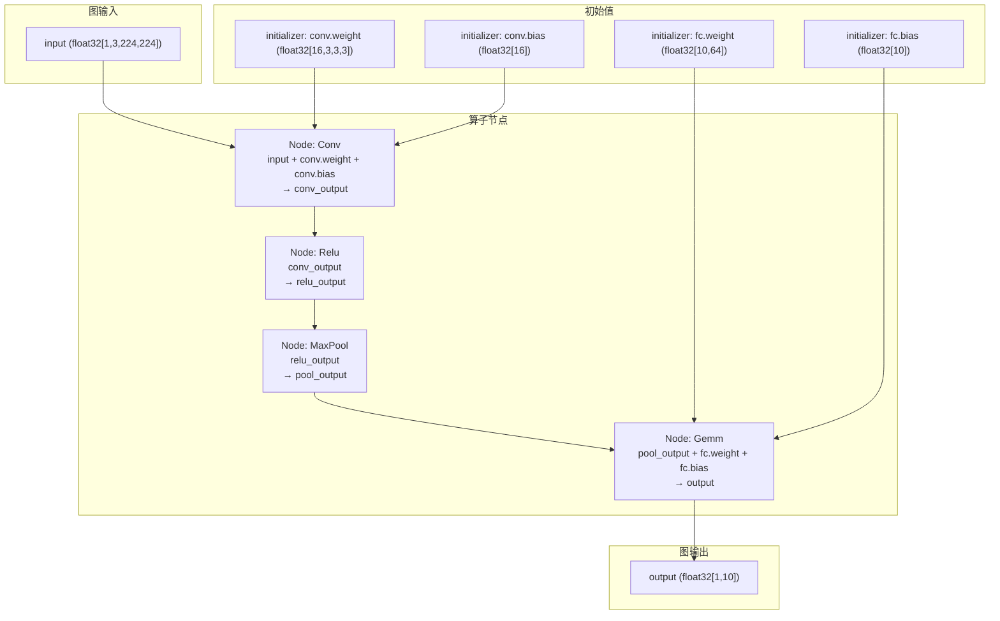

# ONNX 计算图数据结构深度解析

> 从 protobuf 源码层面彻底理解 ONNX 计算图的数据组织方式，掌握手动构造、解析和修改 ONNX 模型的能力。

---

## 目录

1. [ONNX 的整体数据层次](#1-onnx-的整体数据层次)
2. [ModelProto — 模型容器](#2-modelproto--模型容器)
3. [GraphProto — 计算图](#3-graphproto--计算图)
4. [NodeProto — 算子节点](#4-nodeproto--算子节点)
5. [TensorProto — 张量数据](#5-tensorproto--张量数据)
6. [ValueInfoProto — 张量类型信息](#6-valueinfoproto--张量类型信息)
7. [AttributeProto — 算子属性](#7-attributeproto--算子属性)
8. [TypeProto — 类型系统](#8-typeproto--类型系统)
9. [实战：解析 ONNX 模型内部结构](#9-实战解析-onnx-模型内部结构)
10. [实战：手动构造 ONNX 计算图](#10-实战手动构造-onnx-计算图)
11. [实战：修改与优化计算图](#11-实战修改与优化计算图)
12. [总结](#12-总结)

---

## 1. ONNX 的整体数据层次

ONNX 使用 **Protocol Buffers（protobuf）** 作为序列化格式。整个数据结构是严格的树形嵌套：

```
ModelProto                      ← 根节点，整个模型
 ├── ir_version                 ← ONNX IR 版本号
 ├── opset_import[]             ← 导入的算子集（如 ai.onnx v17）
 ├── producer_name              ← 导出工具名称（如 pytorch）
 ├── producer_version           ← 导出工具版本
 └── GraphProto                 ← ⭐ 核心：计算图
      ├── node[]                ← 算子节点列表（DAG 的顶点）
      ├── initializer[]         ← 初始值（权重、偏置等常量）
      ├── input[]               ← 图的输入张量声明
      ├── output[]              ← 图的输出张量声明
      └── value_info[]          ← 中间张量的类型/形状信息
```

```mermaid
graph TD
    subgraph ModelProto
        ir[ir_version: 9]
        opset[opset_import: ai.onnx v17]
        graph["GraphProto ⭐"]
    end
    
    subgraph GraphProto
        nodes["node[] — 算子列表<br>Conv, Relu, Pool..."]
        inits["initializer[] — 常量权重<br>conv.weight, conv.bias..."]
        inputs["input[] — 图输入<br>'input' [1,3,224,224]"]
        outputs["output[] — 图输出<br>'output' [1,10]"]
        vinfo["value_info[] — 中间张量<br>'conv1_output' [1,16,112,112]"]
    end
    
    graph --> nodes
    graph --> inits
    graph --> inputs
    graph --> outputs
    graph --> vinfo
```

> **核心认知**：整个 ONNX 模型就是一棵 protobuf 树，`GraphProto` 是核心，`NodeProto` 是顶点，`TensorProto` 是边的权重。

---

## 2. ModelProto — 模型容器

`ModelProto` 是整个 ONNX 文件的根。它的 protobuf 定义（简化）：

```protobuf
message ModelProto {
  int64 ir_version = 1;                       // ONNX 中间表示版本
  repeated OperatorSetIdProto opset_import = 8; // 导入的算子集
  string producer_name = 2;                    // 导出工具名
  string producer_version = 3;                 // 导出工具版本
  string domain = 4;                           // 域名
  int64 model_version = 5;                     // 模型版本
  string doc_string = 6;                       // 文档说明
  GraphProto graph = 7;                        // ⭐ 计算图
  repeated StringEntryProto metadata_props = 14; // 元数据
}
```

```python
import onnx

model = onnx.load("model.onnx")
print(f"IR version:     {model.ir_version}")
print(f"Producer:       {model.producer_name} v{model.producer_version}")
print(f"Domain:         {model.domain}")
print(f"Model version:  {model.model_version}")
for imp in model.opset_import:
    print(f"Opset import:   {imp.domain} v{imp.version}")
```

输出示例：
```
IR version:     9
Producer:       pytorch v2.5.0
Domain:         None
Model version:  0
Opset import:   ai.onnx v17
Opset import:   org.pytorch.aten v1
```

---

## 3. GraphProto — 计算图 ⭐

`GraphProto` 是 ONNX 的核心，定义了完整的计算 DAG：

```protobuf
message GraphProto {
  repeated NodeProto node = 1;            // ⭐ 图的所有算子节点
  string name = 2;                         // 图名称
  repeated TensorProto initializer = 5;    // ⭐ 常量权重
  repeated ValueInfoProto input = 11;      // 图输入张量声明
  repeated ValueInfoProto output = 12;     // 图输出张量声明
  repeated ValueInfoProto value_info = 13; // 中间张量声明
  string doc_string = 10;                  // 文档说明
}
```

### 3.1 拓扑结构



### 3.2 边（Edge）的表示方式

ONNX 使用 **名字匹配** 来隐式表示边，而不是显式的 Edge 对象：

```
Node[0] (Conv)     output: "conv1_output"
                           │
                           ▼  （同名即连接）
Node[1] (Relu)     input:  "conv1_output"
```

**关键理解**：

- 每个 Node 有 `input[]` 和 `output[]` 字符串列表
- 如果一个 Node 的 output 名字等于另一个 Node 的 input 名字，它们就连在一起
- 名字可以任意起，只要全局唯一匹配
- 这种设计使得图遍历时需要**建邻接表**

```python
# 手动建立邻接关系
graph = model.graph

# 建前驱/后继表
predecessors = {}   # node_name → [前驱节点名]
successors = {}     # node_name → [后继节点名]
tensor_to_node = {} # tensor_name → 生产它的节点名

for node in graph.node:
    for output_name in node.output:
        tensor_to_node[output_name] = node.name

# 遍历每个节点，找输入 tensor 来自哪个节点
for node in graph.node:
    for input_name in node.input:
        if input_name in tensor_to_node:
            pred_name = tensor_to_node[input_name]
            predecessors.setdefault(node.name, []).append(pred_name)
            successors.setdefault(pred_name, []).append(node.name)
```

---

## 4. NodeProto — 算子节点 ⭐

每个 `NodeProto` 代表计算图中的一个算子操作：

```protobuf
message NodeProto {
  repeated string input = 1;      // 输入张量名称列表
  repeated string output = 2;     // 输出张量名称列表
  string name = 3;                // 节点名称（可选）
  string op_type = 4;             // ⭐ 算子类型（Conv, Relu, Add...）
  string domain = 7;              // 算子域（"ai.onnx" 为内置）
  repeated AttributeProto attribute = 5;  // 算子属性
  string doc_string = 6;          // 文档说明
}
```

### 4.1 常见 op_type 列表

| 类别 | 算子 | 说明 |
|------|------|------|
| **卷积** | `Conv`, `ConvTranspose` | 标准卷积/转置卷积 |
| **池化** | `MaxPool`, `AveragePool`, `GlobalAveragePool` | 下采样 |
| **激活** | `Relu`, `Sigmoid`, `Tanh`, `LeakyRelu`, `Softmax` | 非线性 |
| **归一化** | `BatchNormalization`, `LayerNormalization`, `InstanceNormalization` | 归一化层 |
| **全连接** | `Gemm`, `MatMul` | 矩阵乘法/全连接 |
| **张量操作** | `Reshape`, `Transpose`, `Concat`, `Split`, `Slice`, `Gather` | 形状变换 |
| **元素级** | `Add`, `Sub`, `Mul`, `Div`, `Pow`, `Exp`, `Sqrt` | 逐元素运算 |
| **控制流** | `If`, `Loop`, `Scan` | 条件/循环 |
| **量化** | `QuantizeLinear`, `DequantizeLinear` | 量化/反量化 |

### 4.2 节点遍历示例

```python
# 打印计算图的所有节点（拓扑顺序）
for i, node in enumerate(graph.node):
    attrs = {a.name: a for a in node.attribute}
    attr_summary = ", ".join(f"{k}" for k in attrs.keys())
    print(f"[{i:3d}] {node.op_type:20s} | "
          f"输入: {len(node.input):2d}个 | "
          f"输出: {len(node.output):2d}个 | "
          f"属性: {attr_summary if attr_summary else '—'}")
```

---

## 5. TensorProto — 张量数据

`TensorProto` 用于存储**常量数据**（权重、偏置等），也用于 `ValueInfoProto` 中的形状信息：

```protobuf
message TensorProto {
  string name = 1;                  // 张量名称
  int32 data_type = 2;              // ⭐ 数据类型（1=float, 3=int8...）
  repeated int64 dims = 3;          // 形状 [N, C, H, W]
  float float_data = 4;             // 实际数据（具体用哪个字段取决于 data_type）
  bytes raw_data = 9;               // ⭐ 原始字节数据（推荐，效率高）
  string doc_string = 5;            // 文档说明
}
```

### 5.1 数据类型枚举

| data_type | 名称 | 对应 Python 类型 |
|:---------:|------|-----------------|
| 1 | `FLOAT` | `numpy.float32` |
| 2 | `UINT8` | `numpy.uint8` |
| 3 | `INT8` | `numpy.int8` |
| 4 | `UINT16` | `numpy.uint16` |
| 5 | `INT16` | `numpy.int16` |
| 6 | `INT32` | `numpy.int32` |
| 7 | `INT64` | `numpy.int64` |
| 10 | `FLOAT16` | `numpy.float16` |
| 11 | `DOUBLE` | `numpy.float64` |
| 12 | `UINT32` | `numpy.uint32` |
| 13 | `UINT64` | `numpy.uint64` |
| 16 | `BFLOAT16` | `numpy.bfloat16` |

### 5.2 提取权重数据

```python
import numpy as np
import onnx

model = onnx.load("model.onnx")

for init in model.graph.initializer:
    # 方法1：自动转为 numpy 数组
    arr = onnx.numpy_helper.to_array(init)
    print(f"{init.name:30s} shape={str(list(arr.shape)):15s} "
          f"dtype={arr.dtype:10s} "
          f"size={arr.size:>8d}  "
          f"mean={arr.mean():.4f}")

    # 方法2：手动读取原始字节
    # raw = np.frombuffer(init.raw_data, dtype=dtype_map[init.data_type])
    # raw = raw.reshape(init.dims)
```

输出示例：
```
conv1.weight                     shape=[16, 3, 3, 3]   dtype=float32  size=432     mean=0.0021
conv1.bias                       shape=[16]             dtype=float32  size=16      mean=0.0000
fc.weight                        shape=[10, 64]         dtype=float32  size=640     mean=-0.0015
fc.bias                          shape=[10]             dtype=float32  size=10      mean=0.0000
```

---

## 6. ValueInfoProto — 张量类型信息

`ValueInfoProto` 用于声明图中张量的**类型和形状**（不包含实际数据）：

```protobuf
message ValueInfoProto {
  string name = 1;                    // 张量名称
  TypeProto type = 2;                 // ⭐ 类型信息
  string doc_string = 3;              // 文档说明
}
```

`ValueInfoProto` 出现在三个地方：

| 位置 | 含义 |
|------|------|
| `graph.input[]` | 图的所有输入张量声明 |
| `graph.output[]` | 图的所有输出张量声明 |
| `graph.value_info[]` | 中间张量的形状信息（可选） |

```python
print("=== 图输入 ===")
for inp in graph.input:
    print(f"  {inp.name}")

print("\n=== 图输出 ===")
for out in graph.output:
    print(f"  {out.name}")

print("\n=== 中间张量 ===")
for vi in graph.value_info:
    print(f"  {vi.name}")
```

> ⚠️ **常见坑**：许多 ONNX 模型的 `value_info` 是空的！这意味着中间张量的形状信息丢失，需要推理引擎在运行时推导。这就是为什么某些模型需要 `onnx.shape_inference.infer_shapes()` 来补全。

---

## 7. AttributeProto — 算子属性

`AttributeProto` 存储算子节点的**静态属性**（kernel 大小、stride、padding 等）：

```protobuf
message AttributeProto {
  string name = 1;              // 属性名
  int32 type = 20;              // ⭐ 属性值类型
  float f = 2;                  // float 值
  int64 i = 3;                  // int 值
  bytes s = 4;                  // 字符串值
  TensorProto t = 5;            // 张量值
  GraphProto g = 6;             // 子图值
  repeated float floats = 7;    // float 数组
  repeated int64 ints = 8;      // int 数组
  repeated bytes strings = 9;   // 字符串数组
  repeated TensorProto tensors = 10;  // 张量数组
  repeated GraphProto graphs = 11;    // 子图数组
}
```

### 不同类型算子的属性示例

**Conv 算子**的属性：
```python
{
  "kernel_shape": [3, 3],      # ints
  "strides": [1, 1],           # ints
  "pads": [0, 0, 0, 0],       # ints
  "dilations": [1, 1],         # ints
  "group": 1                   # int
}
```

**Reshape 算子**的属性（或输入）：
```
allowzero = 0   # int
```

**Gemm（全连接）** 的属性：
```
alpha = 1.0, beta = 1.0, transA = 0, transB = 0
```

```python
# 查看特定节点的所有属性
for node in graph.node:
    if node.op_type == "Conv":
        print(f"Node: {node.name or '(unnamed)'}")
        for attr in node.attribute:
            if attr.type == 2:    # INT
                print(f"  {attr.name} = {attr.i}")
            elif attr.type == 7:  # INTS
                print(f"  {attr.name} = {list(attr.ints)}")
            elif attr.type == 1:  # FLOAT
                print(f"  {attr.name} = {attr.f}")
```

---

## 8. TypeProto — 类型系统

`TypeProto` 是 ONNX 类型系统的核心，用于描述张量的数据类型和形状：

```protobuf
message TypeProto {
  oneof value {
    TensorTypeProto tensor_type = 1;     // 张量类型（最常见）
    SequenceTypeProto sequence_type = 2; // 序列类型
    MapTypeProto map_type = 3;           // 映射类型
    OptionalTypeProto optional_type = 4;  // 可选类型
    SparseTensorTypeProto sparse_tensor_type = 5;  // 稀疏张量
  }
}

message TensorTypeProto {
  int32 elem_type = 1;                    // 元素类型（float, int64...）
  TensorShapeProto shape = 2;             // 形状
}
```

```python
def get_shape_from_value_info(vi: onnx.ValueInfoProto):
    """从 ValueInfoProto 中提取形状"""
    shape = vi.type.tensor_type.shape
    dims = []
    for dim in shape.dim:
        if dim.dim_value > 0:
            dims.append(dim.dim_value)
        else:
            dims.append("?")  # 动态维度
    return dims

# 获取所有输出形状
for output in graph.output:
    shape = get_shape_from_value_info(output)
    dtype = output.type.tensor_type.elem_type
    print(f"{output.name:20s} shape={shape}  dtype_code={dtype}")
```

---

## 9. 实战：解析 ONNX 模型内部结构

下面是一个完整的 ONNX 模型解析工具，打印计算图的全部信息：

```python
"""
onnx_model_explorer.py — 探索 ONNX 模型内部结构
用法: python onnx_model_explorer.py model.onnx
"""

import onnx
import numpy as np
from typing import Any

DTYPE_MAP = {
    1: "float32",  2: "uint8",   3: "int8",
    4: "uint16",   5: "int16",   6: "int32",
    7: "int64",    8: "string",  9: "bool",
    10: "float16", 11: "float64",12: "uint32",
    13: "uint64",  16: "bfloat16",
}

def explore_onnx(path: str):
    model = onnx.load(path)
    graph = model.graph

    # ── 1. 模型头部信息 ──
    print("=" * 60)
    print("📦 ModelProto 信息")
    print("=" * 60)
    print(f"  IR version:     {model.ir_version}")
    print(f"  Producer:       {model.producer_name} v{model.producer_version}")
    for imp in model.opset_import:
        print(f"  Opset:          {imp.domain or 'ai.onnx'} v{imp.version}")

    # ── 2. 图输入/输出 ──
    print("\n" + "=" * 60)
    print("📥 Graph 输入")
    print("=" * 60)
    for inp in graph.input:
        shape = _get_shape(inp)
        dtype = DTYPE_MAP.get(inp.type.tensor_type.elem_type, "unknown")
        print(f"  {inp.name:30s} shape={shape!s:20s} dtype={dtype}")

    print("\n" + "=" * 60)
    print("📤 Graph 输出")
    print("=" * 60)
    for out in graph.output:
        shape = _get_shape(out)
        dtype = DTYPE_MAP.get(out.type.tensor_type.elem_type, "unknown")
        print(f"  {out.name:30s} shape={shape!s:20s} dtype={dtype}")

    # ── 3. 初始值（权重） ──
    print("\n" + "=" * 60)
    print("🏋️  初始值 (initializer) — 权重/偏置")
    print("=" * 60)
    for init in graph.initializer:
        arr = onnx.numpy_helper.to_array(init)
        print(f"  {init.name:30s} shape={str(list(arr.shape)):15s} "
              f"size={arr.size:>8d}  range=[{arr.min():.3f}, {arr.max():.3f}]")

    # ── 4. 算子节点列表 ──
    print("\n" + "=" * 60)
    print(f"🔧 算子节点 (共 {len(graph.node)} 个)")
    print("=" * 60)
    for i, node in enumerate(graph.node):
        attrs = _summarize_attrs(node)
        print(f"  [{i:3d}] {node.op_type:20s} | "
              f"输入: {_short_str(node.input, 4):40s} | "
              f"输出: {_short_str(node.output, 4)}")
        if attrs:
            print(f"        attr: {attrs}")

    # ── 5. 形状信息统计 ──
    print("\n" + "=" * 60)
    print(f"📐 value_info (中间张量形状声明): {len(graph.value_info)} 个")
    print("=" * 60)
    if graph.value_info:
        for vi in graph.value_info[:10]:  # 只显示前10个
            shape = _get_shape(vi)
            dtype = DTYPE_MAP.get(vi.type.tensor_type.elem_type, "unknown")
            print(f"  {vi.name:30s} shape={shape!s:20s} dtype={dtype}")
        if len(graph.value_info) > 10:
            print(f"  ... 还有 {len(graph.value_info) - 10} 个省略")

def _get_shape(vi: onnx.ValueInfoProto) -> list:
    shape = vi.type.tensor_type.shape
    dims = []
    for dim in shape.dim:
        if dim.dim_param:  # 动态维度（字符串表示）
            dims.append(dim.dim_param)
        else:
            dims.append(dim.dim_value)
    return dims

def _summarize_attrs(node: onnx.NodeProto) -> str:
    parts = []
    for attr in node.attribute:
        if attr.type == 2:    # INT
            parts.append(f"{attr.name}={attr.i}")
        elif attr.type == 7:  # INTS
            parts.append(f"{attr.name}={list(attr.ints)}")
        elif attr.type == 1:  # FLOAT
            parts.append(f"{attr.name}={attr.f}")
        elif attr.type == 4:  # STRING
            parts.append(f"{attr.name}='{attr.s.decode()}'")
    return ", ".join(parts)

def _short_str(items: list, max_len: int = 4) -> str:
    if len(items) <= max_len:
        return ", ".join(items)
    return ", ".join(items[:max_len]) + f", ...(+{len(items)-max_len})"

if __name__ == "__main__":
    import sys
    if len(sys.argv) < 2:
        print("用法: python onnx_model_explorer.py model.onnx")
        sys.exit(1)
    explore_onnx(sys.argv[1])
```

运行后你会得到一份完整的 ONNX 模型"解剖报告"。

---

## 10. 实战：手动构造 ONNX 计算图

为了真正理解 ONNX 数据结构，最好的方法是**从零手写一个 ONNX 模型**：

```python
"""
手工构造一个 ONNX 计算图: input → Conv → Relu → MaxPool → Flatten → Gemm → output
无需任何深度学习框架，只用 onnx 库的 protobuf API。
"""

import onnx
import onnx.helper as helper
import numpy as np

# ── 1. 定义张量形状（ValueInfoProto） ──
input_tensor = helper.make_tensor_value_info(
    "input", onnx.TensorProto.FLOAT, [1, 3, 224, 224]
)
output_tensor = helper.make_tensor_value_info(
    "output", onnx.TensorProto.FLOAT, [1, 10]
)

# ── 2. 创建初始值（权重） ──
conv_weight = helper.make_tensor(
    "conv.weight", onnx.TensorProto.FLOAT,
    dims=[16, 3, 3, 3],
    vals=np.random.randn(16, 3, 3, 3).flatten().tolist(),
)
conv_bias = helper.make_tensor(
    "conv.bias", onnx.TensorProto.FLOAT,
    dims=[16],
    vals=np.random.randn(16).flatten().tolist(),
)
fc_weight = helper.make_tensor(
    "fc.weight", onnx.TensorProto.FLOAT,
    dims=[10, 1024],   # 64*4*4 = 1024 (假设最后特征图 4x4)
    vals=np.random.randn(10, 1024).flatten().tolist(),
)
fc_bias = helper.make_tensor(
    "fc.bias", onnx.TensorProto.FLOAT,
    dims=[10],
    vals=np.random.randn(10).flatten().tolist(),
)

# ── 3. 创建算子节点 ──
nodes = [
    # Conv: input + weight + bias → conv_out
    helper.make_node(
        "Conv", inputs=["input", "conv.weight", "conv.bias"],
        outputs=["conv_out"],
        kernel_shape=[3, 3], strides=[1, 1], pads=[0, 0, 0, 0],
        name="conv1",
    ),
    # Relu: conv_out → relu_out
    helper.make_node("Relu", inputs=["conv_out"], outputs=["relu_out"], name="relu1"),
    # MaxPool: relu_out → pool_out
    helper.make_node(
        "MaxPool", inputs=["relu_out"], outputs=["pool_out"],
        kernel_shape=[2, 2], strides=[2, 2],
        name="pool1",
    ),
    # Flatten 用 Reshape 实现: pool_out → flatten_out
    helper.make_node(
        "Reshape", inputs=["pool_out", "shape"], outputs=["flatten_out"],
        name="flatten",
    ),
    # Gemm (全连接): flatten_out + fc.weight + fc.bias → output
    helper.make_node(
        "Gemm", inputs=["flatten_out", "fc.weight", "fc.bias"],
        outputs=["output"],
        alpha=1.0, beta=1.0, transB=1,
        name="fc1",
    ),
]

# ── 4. 创建额外的常量（Reshape 的目标形状） ──
reshape_shape = helper.make_tensor(
    "shape", onnx.TensorProto.INT64,
    dims=[2],
    vals=[1, 1024],  # batch=1, features=1024
)

# ── 5. 组装 GraphProto ──
graph = helper.make_graph(
    nodes=nodes,
    name="manual_cnn",
    inputs=[input_tensor],
    outputs=[output_tensor],
    initializer=[conv_weight, conv_bias, fc_weight, fc_bias, reshape_shape],
)

# ── 6. 组装 ModelProto ──
model = helper.make_model(graph, opset_imports=[helper.make_opsetid("", 17)])

# ── 7. 添加形状推理信息（可选） ──
model = onnx.shape_inference.infer_shapes(model)

# ── 8. 校验 ──
onnx.checker.check_model(model)

# ── 9. 保存 ──
onnx.save(model, "manual_cnn.onnx")
print("[✓] 成功手工创建 ONNX 模型: manual_cnn.onnx")
```

> 🔑 **核心理解**：通过以上代码可以看到，ONNX 模型本质上就是：
> 1. 一堆 `ValueInfoProto` 声明输入/输出形状
> 2. 一堆 `TensorProto` 存储权重常量
> 3. 一堆 `NodeProto` 连接成计算 DAG
> 4. 用 `GraphProto` 把它们组装起来
> 5. 用 `ModelProto` 包装成完整模型

---

## 11. 实战：修改与优化计算图

### 11.1 遍历并修改节点属性

```python
# 将所有 Conv 的 padding 改为 1
for node in model.graph.node:
    if node.op_type == "Conv":
        for attr in node.attribute:
            if attr.name == "pads":
                attr.ClearField("ints")
                attr.ints.extend([1, 1, 1, 1])
```

### 11.2 插入新节点

```python
# 在 Relu 之前插入一个 Clip（值裁剪）节点
def insert_clip_before_relu(model, min_val=0.0, max_val=6.0):
    graph = model.graph
    new_nodes = []
    for node in graph.node:
        if node.op_type == "Relu":
            # 创建 Clip 节点，接管 Relu 的输入
            clip_out = f"{node.input[0]}_clipped"
            clip_node = helper.make_node(
                "Clip", inputs=[node.input[0]],
                outputs=[clip_out],
                min=min_val, max=max_val,
            )
            # 修改 Relu 的输入为 Clip 的输出
            node.input[0] = clip_out
            new_nodes.append(clip_node)
        new_nodes.append(node)
    # 替换图节点列表
    graph.ClearField("node")
    graph.node.extend(new_nodes)
    return model
```

### 11.3 节点删除与重连

```python
# 删除所有 Dropout 节点（推理时不需要）
def remove_dropout(model):
    graph = model.graph
    # 收集所有 Dropout 节点
    dropout_nodes = [n for n in graph.node if n.op_type == "Dropout"]
    # 记录需要重新连接的边
    reconnect_map = {}
    for node in dropout_nodes:
        # Dropout(input) → (output, mask)  取第一个输出
        reconnect_map[node.input[0]] = node.output[0]

    new_nodes = [n for n in graph.node if n.op_type != "Dropout"]
    # 更新所有引用
    for node in new_nodes:
        for i, inp in enumerate(node.input):
            if inp in reconnect_map:
                node.input[i] = reconnect_map[inp]

    graph.ClearField("node")
    graph.node.extend(new_nodes)
    return model
```

### 11.4 图优化管道示例

```python
def optimize_graph(model):
    """简单的图优化管道"""
    model = remove_dropout(model)
    model = fuse_conv_bn(model)  # 伪代码，需要自实现
    model = onnx.shape_inference.infer_shapes(model)
    return model
```

---

## 12. 总结

### 数据结构层次速查

| 数据结构 | 作用 | 关键字段 |
|---------|------|---------|
| `ModelProto` | 模型根容器 | `ir_version`, `graph`, `opset_import` |
| `GraphProto` | 计算图 ⭐ | `node[]`, `initializer[]`, `input[]`, `output[]` |
| `NodeProto` | 算子节点 ⭐ | `op_type`, `input[]`, `output[]`, `attribute[]` |
| `TensorProto` | 常量数据 | `data_type`, `dims`, `raw_data` |
| `ValueInfoProto` | 张量声明 | `name`, `type` → `TensorTypeProto` |
| `AttributeProto` | 算子属性 | `name`, `type`, `i`/`f`/`ints`/`floats`... |
| `TypeProto` | 类型描述 | `tensor_type.elem_type`, `tensor_type.shape` |

### 核心思维模型

```
ONNX 模型 = protobuf 序列化的一棵层次树
          = GraphProto (计算图) + 元数据
          = NodeProto 的有序列表 + TensorProto 的常量池
          = 一个 DAG，边由名字隐式连接
```

### 关键洞察

1. **名字即边** — ONNX 没有显式的 Edge 对象，张量通过名字匹配连接节点
2. **initializer 是常量池** — 所有权重、偏置都存放在这里，不是输入
3. **value_info 是可选缓存** — 形状信息可以缺失，运行时推导
4. **属性是节点参数** — 与权重不同，属性编译时固定，不可训练
5. **protobuf 可读写** — 你可以用 Python API 自由地创建、修改、优化 ONNX 图

---

*相关工具: `onnx_model_explorer.py`（见上文代码）*
*配套项目: `test_tensorrt/`*
