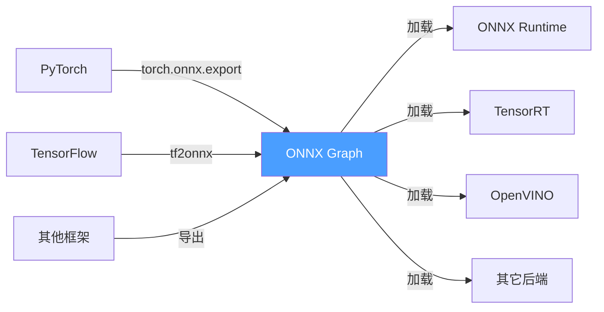
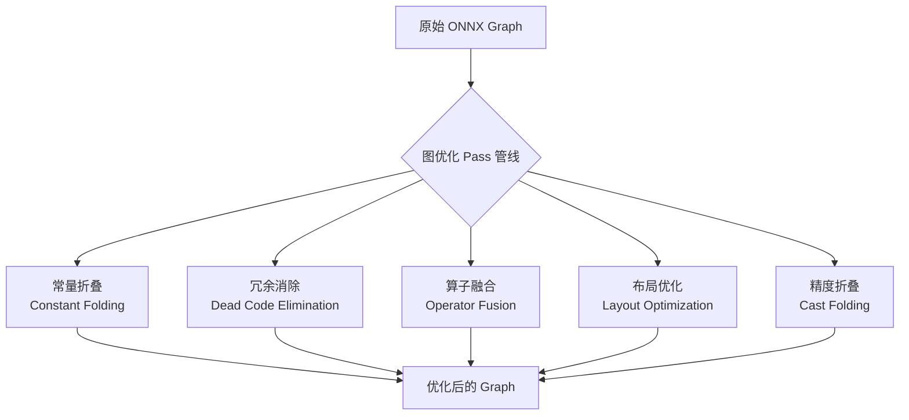
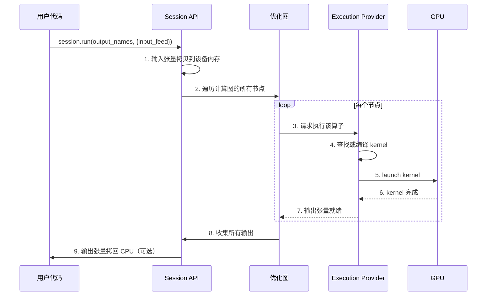

# ONNX 推理引擎原理深度解析

> 理解 ONNX 推理引擎的内部工作机制，掌握深度学习模型部署的核心知识。

---

## 目录

1. [ONNX 的本质：中间表示（IR）](#1-onnx-的本质中间表示ir)
2. [ONNX 计算图数据结构](#2-onnx-计算图数据结构)
3. [推理引擎的架构（以 ONNX Runtime 为例）](#3-推理引擎的架构以-onnx-runtime-为例)
   - 3.1 [Graph 优化层](#31-graph-优化层--推理引擎的编译器)
   - 3.2 [Execution Provider（EP）机制](#32-execution-providerep-机制--核心抽象)
4. [推理执行流程](#4-推理执行流程从调用到结果)
5. [手动实践 — 深入观察推理引擎内部](#5-手动实践--深入观察推理引擎内部)
6. [核心原理总结](#6-核心原理总结)
7. [推荐深入学习路径](#7-推荐深入学习路径)

---

## 1. ONNX 的本质：中间表示（IR）

ONNX 既不是框架，也不是运行时，而是一种**计算图中间表示格式**：

```
PyTorch/TF ──► ONNX (protobuf) ──► 推理引擎 ──► GPU/CPU 执行
                  ↑                      ↑
              静态计算图               IR 解释器
```



**关键认知**：ONNX 只是**传输层协议**，真正的加速来自推理引擎对不同硬件的优化。

---

## 2. ONNX 计算图数据结构

一个 ONNX 模型本质上是一个 **protobuf 序列化的无环有向图（DAG）**，核心数据结构：

```
ModelProto
 └── GraphProto                     ← 计算图
      ├── NodeProto[]               ← 算子节点（Conv, Relu, Add...）
      │    ├── input[]              ← 输入名称列表
      │    ├── output[]             ← 输出名称列表
      │    ├── op_type              ← 算子类型
      │    └── attribute[]          ← 属性（kernel_shape, strides...）
      ├── TensorProto[]             ← 初始值（权重、偏置等常量）
      ├── ValueInfoProto[]          ← 输入/输出张量信息
      └── ValueInfoProto[]          ← 所有中间张量信息
```

```python
# 用代码观察 ONNX 内部结构
import onnx

model = onnx.load("model.onnx")
graph = model.graph

for node in graph.node[:5]:         # 打印前5个节点
    print(f"Op: {node.op_type:10s}  "
          f"Inputs: {str([i for i in node.input]):40s}  "
          f"Outputs: {node.output}")
```

运行后会看到类似：

```
Op: Conv         Inputs: ['input', 'conv1.weight', 'conv1.bias']    Outputs: ['conv1_output']
Op: Relu         Inputs: ['conv1_output']                           Outputs: ['relu1_output']
Op: MaxPool      Inputs: ['relu1_output']                           Outputs: ['pool1_output']
```

---

## 3. 推理引擎的架构（以 ONNX Runtime 为例）

这是最核心的部分，ONNX Runtime 的内部架构分为四层：

```
┌──────────────────────────────────────────────────────┐
│                   用户 API 层                         │
│  InferenceSession.run(output_names, {input_feed})    │
└──────────────────────┬───────────────────────────────┘
                       ▼
┌──────────────────────────────────────────────────────┐
│                   Graph 优化层                        │
│  ┌──────────┐  ┌──────────┐  ┌──────────────────┐   │
│  │ 常量折叠  │→ │ 算子融合  │→ │ 子图划分/替换    │   │
│  └──────────┘  └──────────┘  └──────────────────┘   │
└──────────────────────┬───────────────────────────────┘
                       ▼
┌──────────────────────────────────────────────────────┐
│                Execution Provider 层                  │
│  ┌──────────┐  ┌──────────┐  ┌──────────────────┐   │
│  │ CPU EP   │  │ CUDA EP  │  │ TensorRT EP      │   │
│  └──────────┘  └──────────┘  └──────────────────┘   │
│  ┌──────────┐  ┌──────────┐  ┌──────────────────┐   │
│  │ OpenVINO │  │ CoreML   │  │ 自定义 EP        │   │
│  └──────────┘  └──────────┘  └──────────────────┘   │
└──────────────────────┬───────────────────────────────┘
                       ▼
┌──────────────────────────────────────────────────────┐
│                 硬件执行层                             │
│              GPU kernel / CPU kernel                  │
└──────────────────────────────────────────────────────┘
```

### 3.1 Graph 优化层 — 推理引擎的"编译器"

ONNX Runtime 加载模型后会做一系列**图优化**，这是理解推理引擎的关键：



**算子融合的典型例子**：

```
# 优化前（3个节点）
Conv → BatchNorm → Relu

# 优化后（1个节点）
ConvBNRelu  ← 一个融合 kernel 完成全部计算
```

> 融合后减少了 kernel launch 开销、内存读写次数，这是推理引擎**最大的加速来源之一**。

### 3.2 Execution Provider（EP）机制 — 核心抽象

每个 EP 本质上是一个**算子库适配器**：

```
Session 创建时:
  1. 用户指定 EP 优先级: ["TensorrtEP", "CUDAEP", "CPUEP"]
  2. 引擎遍历每个算子，检查哪个 EP 能执行它
  3. 高优先级 EP 能执行的算子归它管
  4. 不能执行的"漏掉"的算子，降级到下一个 EP
```

```python
# 这背后发生的过程
session = ort.InferenceSession(
    "model.onnx",
    providers=[
        "TensorrtExecutionProvider",   # 第一个尝试
        "CUDAExecutionProvider",       # 回退1
        "CPUExecutionProvider",        # 最后回退
    ]
)
```

**关键认知**：ONNX Runtime 本身只是一个编排框架，**真正的计算全部委托给 EP**。CPU EP 调用 `mklml`，CUDA EP 调用 `cudnn`，TensorRT EP 调用 TensorRT 的 C++ API。

---

## 4. 推理执行流程（从调用到结果）

理解一次 `session.run()` 背后发生的事：



**核心时间线**：

| 阶段 | 发生时机 | 耗时占比 |
|------|---------|---------|
| **Session 创建** | `__init__` | 大（秒级）— 图优化 + kernel 编译 |
| **输入拷贝** | 每次 `run()` | 中 — 取决于数据大小 |
| **算子执行** | 每次 `run()` | 大 — 实际计算 |
| **输出拷贝** | 每次 `run()` | 中 — 取决于输出大小 |

> 🔑 **深刻理解**：Session 创建很慢（因为要做图优化和 kernel 编译），创建后应**复用**。每次 `run()` 只做计算和 I/O。

---

## 5. 手动实践 — 深入观察推理引擎内部

为了真正"深刻理解"，建议做以下动手实验：

### 实验 1：可视化计算图

```python
import onnx
from onnx.tools.net_drawer import GetPydotGraph

model = onnx.load("model.onnx")
graph = GetPydotGraph(model.graph, name="Graph", rankdir="TB")
graph.write_png("graph.png")   # 看到完整的 DAG
```

### 实验 2：检查执行提供者的算子分配

```python
import onnxruntime as ort
session = ort.InferenceSession("model.onnx", providers=["CPUExecutionProvider"])
# 查看每个算子在哪个 EP 上执行
for node in session._sess._model_graph.nodes:
    print(f"{node.op_type:15s} → {node.execution_provider}")
```

### 实验 3：对比不同 EP 的性能

```python
import onnxruntime as ort
import numpy as np
import time

def bench(providers, name):
    session = ort.InferenceSession("model.onnx", providers=providers)
    warmup = 10
    repeats = 100
    # warmup
    for _ in range(warmup):
        session.run(None, {"input": np.random.randn(1,3,224,224).astype(np.float32)})
    # benchmark
    start = time.perf_counter()
    for _ in range(repeats):
        session.run(None, {"input": np.random.randn(1,3,224,224).astype(np.float32)})
    avg = (time.perf_counter() - start) / repeats * 1000
    print(f"{name:15s}: {avg:.2f} ms")

bench(["CPUExecutionProvider"], "CPU")
bench(["CUDAExecutionProvider", "CPUExecutionProvider"], "CUDA")
bench(["TensorrtExecutionProvider", "CUDAExecutionProvider", "CPUExecutionProvider"], "TensorRT")
```

### 实验 4：读取 Profiling 数据

```python
# 启用 profiling
options = ort.SessionOptions()
options.enable_profiling = True
session = ort.InferenceSession("model.onnx", options, providers=["CPUExecutionProvider"])
session.run(None, {"input": data})
prof_file = session.end_profiling()

# 查看 profiling 结果（json 格式）
import json
with open(prof_file) as f:
    prof = json.load(f)
for entry in prof:
    print(f"{entry['cat']:15s} {entry['name']:30s} {entry['dur']:>8.2f} us")
```

---

## 6. 核心原理总结

| 概念 | 一句话理解 |
|------|-----------|
| **ONNX 格式** | 一种序列化计算图的 protobuf 协议，**不参与计算** |
| **推理引擎** | 一个计算图解释器 + 算子调度器 |
| **图优化** | 在计算图上做等价变换以减少计算量（编译器前端） |
| **Execution Provider** | 负责将算子映射到硬件 kernel（编译器后端） |
| **Session** | 一次图优化的结果，包含所有预编译的 kernel |
| **run()** | 触发的是一次拓扑排序后的 kernel launch 序列 |

```
最终结论：
ONNX Runtime = 图优化器 + 算子调度框架
硬件加速    = EP 提供的各种 CUDA / TensorRT kernel
两者结合    = 你的模型在 GPU 上高效运行
```

---

## 7. 推荐深入学习路径

1. **阅读 ONNX Runtime 源码** — 重点关注 `onnxruntime/core/session/` 和 `onnxruntime/core/providers/`
2. **学习 MLIR / StableHLO** — 现代推理引擎越来越多采用 MLIR 作为基础架构
3. **手写一个微型推理引擎**（强推）— 解析 ONNX 图 → 内存分配 → 拓扑排序执行，只用 500 行就能深刻理解
4. **理解 CUDA kernel launch** — 使用 `nsys profile` 和 `ncu` 观察 GPU kernel 的执行时间线
5. **Benchmark 对比实验** — 用上面的实验 3 代码，直观感受不同推理后端（CPU vs CUDA vs TensorRT）的性能差异

---

*生成日期: 2026-07-07*
*相关项目: `test_tensorrt/`*
