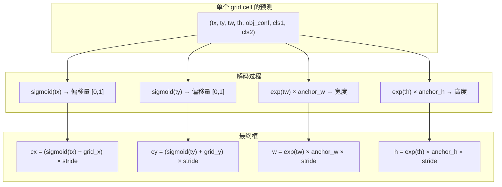
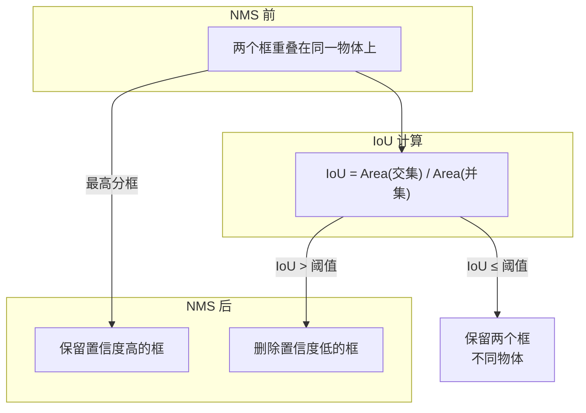

# ONNX 图像检测应用实战

> 从原理到代码，掌握 ONNX 在目标检测领域的完整应用流程。

---

## 目录

1. [目标检测基础概念](#1-目标检测基础概念)
2. [ONNX 检测模型的数据流](#2-onnx-检测模型的数据流)
3. [完整推理管线](#3-完整推理管线)
4. [预处理：图像到张量](#4-预处理图像到张量)
5. [模型推理：ONNX Runtime 执行](#5-模型推理onnx-runtime-执行)
6. [后处理：从张量到检测框](#6-后处理从张量到检测框)
   - 6.1 [YOLO 输出格式解码](#61-yolo-输出格式解码)
   - 6.2 [置信度过滤](#62-置信度过滤)
   - 6.3 [坐标映射回原图](#63-坐标映射回原图)
   - 6.4 [NMS 非极大值抑制](#64-nms-非极大值抑制)
7. [可视化与结果输出](#7-可视化与结果输出)
8. [完整代码流程](#8-完整代码流程)
9. [性能优化技巧](#9-性能优化技巧)
10. [常见问题与调试](#10-常见问题与调试)

---

## 1. 目标检测基础概念

目标检测的任务是：**在一张图中找出所有感兴趣的物体，标注其位置和类别**。

```
输入: 一张 RGB 图像 (H, W, 3)
输出: 一组检测结果
       ┌────────┬───────┬──────────────────────────┐
       │  框    │ 置信度 │  类别                     │
       ├────────┼───────┼──────────────────────────┤
       │[x,y,w,h]│ 0.95  │ person (类别ID=0)        │
       │[x,y,w,h]│ 0.87  │ car    (类别ID=2)        │
       └────────┴───────┴──────────────────────────┘
```

### 1.1 边界框表示

| 表示方式 | 格式 | 说明 |
|---------|------|------|
| **xywh** | `[cx, cy, w, h]` | 中心点 + 宽高（YOLO 原生格式） |
| **xyxy** | `[x1, y1, x2, y2]` | 左上角 + 右下角（更易可视化） |
| **xywh_norm** | `[cx, cy, w, h]` 归一化 | 值在 [0,1] 之间 |

### 1.2 检测模型的输出结构

以 YOLOv5 为例，原始输出是一个三维张量：

```
输出 shape: [1, 25200, 7]
              │    │     │
              │    │     └── 每个 anchor 的预测值
              │    └──────── 所有 anchor 总数
              └───────────── batch size
```

**这 7 个值的含义：**

```
[tx,  ty,  tw,  th,  obj_conf,  cls_1,  cls_2]
  │    │    │    │      │          │       │
  │    │    │    │      │          │       └── 类别2 得分
  │    │    │    │      │          └────────── 类别1 得分
  │    │    │    │      └───────────────────── 物体置信度
  │    │    │    └──────────────────────────── 高度偏移（对数空间）
  │    │    └───────────────────────────────── 宽度偏移（对数空间）
  │    └────────────────────────────────────── y 坐标偏移
  └─────────────────────────────────────────── x 坐标偏移
```

**25200 的来源：**
```
640×640 输入 → 3 个检测尺度 (stride=8, 16, 32)
→ 每个尺度 3 个 anchor
→ (80×80 + 40×40 + 20×20) × 3 = 25200
```

---

## 2. ONNX 检测模型的数据流

```mermaid
flowchart LR
    subgraph 预处理
        A[输入图像] --> B[LetterBox<br>保持宽高比填充]
        B --> C[Normalize<br>÷255]
        C --> D[HWC→CHW]
        D --> E[Add Batch Dim<br>→ (1,3,640,640)]
    end

    subgraph 推理
        E --> F[ONNX Runtime<br>session.run()]
    end

    subgraph 后处理
        F --> G[原始输出<br>(1,25200,7)]
        G --> H[解码<br>→ 边界框]
        H --> I[置信度过滤]
        I --> J[坐标反算<br>→ 原图坐标系]
        J --> K[NMS<br>去重]
    end

    subgraph 输出
        K --> L[最终检测结果]
        L --> M[可视化<br>绘制边界框]
    end
```

### 数据形状变化

| 阶段 | 形状 | 说明 |
|------|------|------|
| 原始图像 | `(H, W, 3)` | BGR uint8 [0,255] |
| LetterBox | `(640, 640, 3)` | 填充后 |
| 归一化 | `(640, 640, 3)` | float32 [0,1] |
| CHW | `(3, 640, 640)` | 通道优先 |
| 模型输入 | `(1, 3, 640, 640)` | + batch |
| 模型输出 | `(1, 25200, 7)` | 原始预测 |
| 解码后 | `(N, 4)` + `(N,)` + `(N,)` | 框 + 置信度 + 类别 |
| NMS 后 | `(M, 4)` + `(M,)` + `(M,)` | M ≤ N，最终结果 |

---

## 3. 完整推理管线

一个完整的 ONNX 检测推理管线由 **5 个步骤** 组成：

```python
# ═══════════════════════════════════════════════════════════════
#  伪代码 — 完整推理流程
# ═══════════════════════════════════════════════════════════════

def detect(image_path: str, model_path: str) -> list[Detection]:
    # 1. 加载模型
    session = ort.InferenceSession(model_path)

    # 2. 读取 + 预处理图像
    image = cv2.imread(image_path)
    input_tensor = preprocess(image)        # → (1,3,640,640)

    # 3. ONNX 推理
    outputs = session.run(None, {"images": input_tensor})

    # 4. 后处理（解码 → 过滤 → NMS）
    detections = postprocess(outputs[0], image.shape)

    # 5. 可视化
    result = draw_detections(image, detections)

    return detections
```

> **对应文件**: `src/onnx_detect_demo.py` 实现了上述完整流程。

---

## 4. 预处理：图像到张量

### 4.1 LetterBox 填充

检测模型要求固定尺寸输入（如 640×640），但实际图像尺寸各异。直接拉伸会破坏宽高比，导致检测精度下降。**LetterBox** 在保持宽高比的前提下填充到目标尺寸。

```mermaid
graph TD
    subgraph 原始图像 800×600
        O[图像内容]
    end

    subgraph 错误做法: 直接拉伸
        W["640×640 (变形)"]
    end

    subgraph 正确做法: LetterBox
        R["640×640 (保持比例)"]
    end

    O -->|resize 到 640×640| W
    O -->|resize + 填充| R
```

**计算公式：**

```
scale = min(640 / w, 640 / h)          # 取最小缩放比
new_w, new_h = w × scale, h × scale    # 缩放后尺寸
pad_w = (640 - new_w) / 2              # 水平填充量
pad_h = (640 - new_h) / 2              # 垂直填充量
```

```python
def letterbox(image, target_size=(640, 640), color=(114, 114, 114)):
    h, w = image.shape[:2]
    target_w, target_h = target_size

    # 计算缩放比例
    scale = min(target_w / w, target_h / h)
    new_w, new_h = int(w * scale), int(h * scale)

    # Resize
    resized = cv2.resize(image, (new_w, new_h))

    # 创建画布并填充
    canvas = np.full((target_h, target_w, 3), color, dtype=np.uint8)
    pad_w = (target_w - new_w) // 2
    pad_h = (target_h - new_h) // 2
    canvas[pad_h:pad_h+new_h, pad_w:pad_w+new_w] = resized

    return canvas, scale, (pad_w, pad_h)
```

### 4.2 完整的预处理链

```python
def preprocess(image):
    # 1. LetterBox
    padded, scale, (pad_w, pad_h) = letterbox(image, (640, 640))

    # 2. BGR→RGB + 归一化 [0,255] → [0,1]
    rgb = padded[..., ::-1].astype(np.float32) / 255.0

    # 3. HWC → CHW  (H,W,3) → (3,H,W)
    chw = np.transpose(rgb, (2, 0, 1))

    # 4. Add batch dim  (3,H,W) → (1,3,H,W)
    input_tensor = np.expand_dims(chw, axis=0)

    return input_tensor, scale, (pad_w, pad_h)
```

---

## 5. 模型推理：ONNX Runtime 执行

### 5.1 选择 Execution Provider

```python
def load_model(onnx_path, device="cpu"):
    providers = []

    if device == "tensorrt":
        providers.append(("TensorrtExecutionProvider", {
            "device_id": 0,
            "trt_max_workspace_size": 4 << 30,  # 4GB
            "trt_fp16_enable": True,
        }))

    if device == "cuda":
        providers.append(("CUDAExecutionProvider", {
            "device_id": 0,
        }))

    providers.append("CPUExecutionProvider")  # 兜底

    session = ort.InferenceSession(onnx_path, providers=providers)
    return session
```

### 5.2 执行推理

```python
session, input_name, output_name = load_model("best.onnx", "cpu")

# 单次推理
outputs = session.run([output_name], {input_name: input_tensor})
# outputs[0].shape = (1, 25200, 7)
```

**`session.run()` 内部发生了什么：**

```
1. CPU→GPU 拷贝输入数据（如果使用 GPU）
2. 遍历优化后的计算图
3. 依次 launch 每个算子的 kernel
4. GPU→CPU 拷贝输出数据（如果使用 GPU）
```

---

## 6. 后处理：从张量到检测框

这是整个流程中最复杂的部分，也是最容易出错的环节。

### 6.1 YOLO 输出格式解码

YOLOv5 的原始输出是**偏移量**，需要解码为实际坐标。

**YOLO 的检测原理：**

```
每个 grid cell 预测:
  - tx, ty: 相对于 grid cell 左上角的偏移 (sigmoid 归一化到 [0,1])
  - tw, th: 相对于 anchor 的宽高缩放 (exp 确保正数)
  - obj_conf: 该位置有物体的概率
  - cls_scores: 各分类的概率

解码公式:
  bx = (sigmoid(tx) + grid_x) × stride
  by = (sigmoid(ty) + grid_y) × stride
  bw = exp(tw) × anchor_w × stride
  bh = exp(th) × anchor_h × stride
```



```python
def decode_yolov5_output(output, num_classes=2):
    """
    output shape: (25200, 7)
    逐尺度解码并合并所有结果
    """
    all_boxes, all_scores, all_class_ids = [], [], []
    grid_idx = 0

    for stride_idx, stride in enumerate(STRIDES):
        grid_size = 640 // stride
        n = grid_size * grid_size * 3  # 3 anchors per scale

        # 取出当前尺度的输出
        scale_output = output[grid_idx:grid_idx + n]
        grid_idx += n
        scale_output = scale_output.reshape(
            grid_size, grid_size, 3, -1
        )

        # 生成网格坐标
        grid_x, grid_y = np.meshgrid(
            np.arange(grid_size), np.arange(grid_size)
        )

        anchors = ANCHORS[stride_idx] / stride

        # 解码
        cx = (sigmoid(scale_output[..., 0]) + grid_x) * stride
        cy = (sigmoid(scale_output[..., 1]) + grid_y) * stride
        w  = np.exp(scale_output[..., 2]) * anchors[:, 0] * stride
        h  = np.exp(scale_output[..., 3]) * anchors[:, 1] * stride

        # cx,cy,w,h → x1,y1,x2,y2
        boxes = np.stack([
            cx - w/2, cy - h/2, cx + w/2, cy + h/2
        ], axis=-1).reshape(-1, 4)

        scores = (sigmoid(scale_output[..., 4]) *
                  sigmoid(scale_output[..., 5:]).max(-1)).reshape(-1)
        class_ids = sigmoid(scale_output[..., 5:]).argmax(-1).reshape(-1)

        all_boxes.append(boxes)
        all_scores.append(scores)
        all_class_ids.append(class_ids)

    return (np.concatenate(all_boxes),
            np.concatenate(all_scores),
            np.concatenate(all_class_ids))
```

### 6.2 置信度过滤

解码后得到了几十万个候选框，大部分是背景。用置信度阈值快速过滤：

```python
mask = scores > CONF_THRESHOLD  # 如 0.25
boxes = boxes[mask]
scores = scores[mask]
class_ids = class_ids[mask]
```

这一步通常能将候选框从 **25200** 减少到 **几十到几百个**。

### 6.3 坐标映射回原图

因为预处理时做了 LetterBox，检测到的坐标是在 **填充后的 640×640 图像** 上的，需要逆映射回原始图像：

```python
# 坐标从 640×640 坐标系 → 原始图像坐标系
pad_w, pad_h = pad  # 填充量
orig_h, orig_w = image_shape[:2]

boxes[:, [0, 2]] = (boxes[:, [0, 2]] - pad_w) / scale  # x1, x2
boxes[:, [1, 3]] = (boxes[:, [1, 3]] - pad_h) / scale  # y1, y2

# 裁剪到图像边界
boxes[:, [0, 2]] = np.clip(boxes[:, [0, 2]], 0, orig_w)
boxes[:, [1, 3]] = np.clip(boxes[:, [1, 3]], 0, orig_h)
```

```mermaid
graph LR
    subgraph 640×640 坐标系
        A[框在填充图上]
    end

    A -->|减去填充 pad_w, pad_h| B[去掉填充区域]
    B -->|除以缩放比例 scale| C[原始分辨率]
    C -->|裁剪到图像边界| D[最终框坐标]
```

### 6.4 NMS 非极大值抑制

多个检测框可能重叠在同一个物体上，NMS 用于**保留最佳框，删除重复框**。

**算法流程：**

```
输入: 一组候选框 + 置信度 + IoU 阈值
─────────────────────────────────────────────
1. 按置信度降序排列
2. 取最高分框，加入到最终结果
3. 计算该框与所有剩余框的 IoU
4. 删除 IoU > 阈值的框（重叠度过高）
5. 重复 2-4，直到无框剩余
─────────────────────────────────────────────
输出: 一组无重复的检测框
```

```python
def compute_iou(box, boxes):
    """计算 box 与 boxes 的 IoU"""
    # 交集面积
    x1 = np.maximum(box[0], boxes[:, 0])
    y1 = np.maximum(box[1], boxes[:, 1])
    x2 = np.minimum(box[2], boxes[:, 2])
    y2 = np.minimum(box[3], boxes[:, 3])
    inter = np.maximum(0, x2 - x1) * np.maximum(0, y2 - y1)

    # 并集面积
    area1 = (box[2] - box[0]) * (box[3] - box[1])
    area2 = (boxes[:, 2] - boxes[:, 0]) * (boxes[:, 3] - boxes[:, 1])
    union = area1 + area2 - inter

    return np.where(union > 0, inter / union, 0)


def nms(boxes, scores, iou_threshold=0.45):
    order = np.argsort(scores)[::-1]  # 降序
    keep = []

    while len(order) > 0:
        i = order[0]
        keep.append(i)

        if len(order) == 1:
            break

        ious = compute_iou(boxes[i], boxes[order[1:]])
        order = order[1:][ious < iou_threshold]

    return keep
```

**IoU 示意图：**



---

## 7. 可视化与结果输出

```python
def draw_detections(image, detections, class_names):
    """在图像上绘制所有检测结果"""
    img = image.copy()

    for det in detections:
        x1, y1, x2, y2 = map(int, det["box"])
        conf = det["conf"]
        cls_id = det["class_id"]
        label = f"{class_names[cls_id]} {conf:.2f}"
        color = COLORS[cls_id % len(COLORS)]

        # 绘制边界框
        cv2.rectangle(img, (x1, y1), (x2, y2), color, 2)

        # 绘制标签（文字背景 + 文字）
        (tw, th), _ = cv2.getTextSize(label, cv2.FONT_HERSHEY_SIMPLEX, 0.6, 2)
        cv2.rectangle(img, (x1, y1 - th - 8), (x1 + tw + 8, y1), color, -1)
        cv2.putText(img, label, (x1 + 4, y1 - 6),
                    cv2.FONT_HERSHEY_SIMPLEX, 0.6, (255, 255, 255), 2)

    return img
```

**输出格式规范：**

```python
# 标准检测结果格式
detections = [
    {
        "box":      [x1, y1, x2, y2],  # int, 原始图像像素坐标
        "conf":     0.95,              # float, [0,1]
        "class_id": 0,                 # int, 类别索引
    },
    # ...
]
```

---

## 8. 完整代码流程

完整的可运行代码见 `src/onnx_detect_demo.py`，其结构如下：

```
src/onnx_detect_demo.py
├── load_model()       ── 加载 ONNX 模型，选择后端
├── preprocess()       ── 图像预处理 (LetterBox + 归一化 + CHW)
├── decode_yolov5_output()  ── YOLO 输出解码
├── nms()              ── 非极大值抑制
├── postprocess()      ── 整合解码 + 过滤 + NMS
├── draw_detections()  ── 可视化
├── inference_single_image()  ── 单图推理
└── inference_video()  ── 视频/摄像头推理
```

### 运行方法

```bash
# 单张图片
python onnx_detect_demo.py --image path/to/image.jpg

# 视频文件
python onnx_detect_demo.py --video path/to/video.mp4

# 摄像头实时检测
python onnx_detect_demo.py --webcam 0

# GPU 加速
python onnx_detect_demo.py --image test.jpg --device cuda

# 调整阈值
python onnx_detect_demo.py --image test.jpg --conf 0.5 --iou 0.5
```

---

## 9. 性能优化技巧

### 9.1 后端选择

| 后端 | 延迟 (ms) | 吞吐量 | 适用场景 |
|------|-----------|--------|---------|
| CPU | ~50-100 | 低 | 无 GPU、开发调试 |
| CUDA | ~10-20 | 高 | 有 NVIDIA GPU |
| TensorRT | ~5-15 | 最高 | 生产部署、低延迟要求 |

### 9.2 Session 复用

```python
# ❌ 错误：每次推理都创建 Session（极慢）
def bad_detect(frame):
    session = ort.InferenceSession("model.onnx")
    return session.run(...)

# ✅ 正确：Session 全局复用
session = ort.InferenceSession("model.onnx")
def good_detect(frame):
    return session.run(...)
```

### 9.3 批量推理

```python
# 将多张图拼成一个 batch 同时推理
batch = np.concatenate([img1, img2, img3, img4], axis=0)  # (4,3,640,640)
outputs = session.run(None, {"images": batch})             # (4,25200,7)
```

### 9.4 异步推理（视频流）

```python
# 使用 AsyncSession 实现流水线
session = ort.InferenceSession("model.onnx")
async_session = ort.AsyncSession(session)

# 推理不阻塞主线程
future = async_session.run_async(None, {"images": input_tensor})
# 处理其他逻辑...
results = future.result()
```

### 9.5 模型优化

```bash
# 简化 ONNX 模型
python -m onnxsim best.onnx best_sim.onnx

# 量化到 FP16 (可减少 50% 显存，速度提升 ~1.5x)
# 使用 TensorRT 或 onnxruntime 的量化工具
```

---

## 10. 常见问题与调试

### 10.1 检测框偏移

**症状**：框画出来了，但位置不对
**原因**：坐标映射公式错误

**排查步骤**：
1. 打印 `scale` 和 `pad` 值，确认与预处理一致
2. 检查是 xywh→xyxy 转换有误，还是逆映射公式有误
3. 用一张简单图像（如白底单个物体）调试

### 10.2 无检测结果

**症状**：`detections` 为空
**原因**：
1. 置信度阈值太高 (`--conf 0.5` → 降低)
2. 预处理与训练时不匹配（归一化方式、通道顺序）
3. 类别数不对（当前 `CLASS_NAMES` 与实际不符）

### 10.3 大量重复框

**症状**：同一物体有十几个框
**原因**：NMS 失效

**检查**：
1. NMS 的 IoU 阈值是否设置正确
2. 是否按类别分别做了 NMS
3. 坐标是否在同一个坐标系下

### 10.4 推理速度慢

**可能的瓶颈和解决方案：**

| 瓶颈 | 现象 | 解决 |
|------|------|------|
| CPU 推理 | CPU 占用 100% | 使用 CUDA / TensorRT |
| 后处理 | 解码 + NMS 耗时长 | 用 `numpy` 向量化，或改用 `torch` 实现 |
| 图像解码 | `cv2.imread` 慢 | 使用 `turbojpeg` 或 GPU 解码 |
| 视频帧率 | `cv2.VideoCapture` 卡顿 | 跳帧处理，或使用硬件解码 |

### 10.5 内存泄漏

```python
# 每次推理后显存增长？检查是否关闭了 profile
options = ort.SessionOptions()
# options.enable_profiling = True  # 调试完后关闭！
session = ort.InferenceSession("model.onnx", options)
```

### 10.6 断点调试技巧

```python
# 保存预处理和推理的中间结果，方便对比
np.save("input_tensor.npy", input_tensor)   # 检查输入
np.save("raw_output.npy", outputs[0])       # 检查原始输出

# 与原版 PyTorch 的推理结果对比，定位差异
# 如果两者一致，问题在后处理；不一致则问题在 ONNX 导出
```

---

## 附录：配套文件

| 文件 | 说明 |
|------|------|
| `src/onnx_detect_demo.py` | 完整的 ONNX 检测推理代码 |
| `readme/ONNX-1.计算图数据结构深度解析.md` | ONNX protobuf 数据结构详解 |
| `readme/ONNX-2.推理引擎原理.md` | ONNX Runtime 架构原理 |
| `readme/ONNX-3.图像检测应用实战.md` | **本文** — 检测应用实战 |
| `readme/TRT-1.TensorRT系统性学习指南.md` | TensorRT 进阶 |

---

*相关代码: `src/onnx_detect_demo.py`*
*测试模型: `model/best.onnx` (YOLOv5, 2 classes)*
