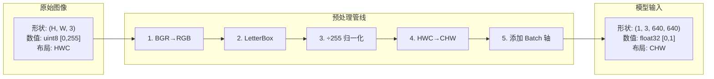

# 预处理原理与代码详解

> 从像素到张量：理解检测模型输入的每一处细节。

---

## 目录

1. [为什么需要预处理](#1-为什么需要预处理)
2. [完整的预处理链](#2-完整的预处理链)
3. [步骤一：BGR 与 RGB 的色彩空间](#3-步骤一bgr-与-rgb-的色彩空间)
4. [步骤二：LetterBox 填充](#4-步骤二letterbox-填充)
5. [步骤三：归一化 Normalize](#5-步骤三归一化-normalize)
6. [步骤四：HWC → CHW 转置](#6-步骤四hwc--chw-转置)
7. [步骤五：添加 Batch 维度](#7-步骤五添加-batch-维度)
8. [完整代码逐行解释](#8-完整代码逐行解释)
9. [常见问题](#9-常见问题)

---

## 1. 为什么需要预处理

深度学习模型对输入数据有严格的格式要求，而原始图像与模型输入之间存在**三个不匹配**：

| 不匹配 | 原始图像 | 模型要求 | 解决方案 |
|--------|---------|---------|---------|
| **尺寸** | 任意 (1920×1080, 800×600) | 固定 (640×640) | LetterBox |
| **数值范围** | [0, 255] uint8 | [0, 1] 或 [-1, 1] float32 | 归一化 |
| **数据布局** | HWC (高×宽×通道) | CHW (通道×高×宽) | 转置 |
| **批次维度** | 单张图像 | 支持批量推理 | 添加 batch 轴 |



---

## 2. 完整的预处理链

```python
def preprocess(image: np.ndarray) -> tuple:
    """
    完整预处理管线:
      图像 → BGR→RGB → LetterBox → Normalize → HWC→CHW → Add Batch

    参数:
        image: np.ndarray, shape=(H, W, 3), dtype=uint8, BGR

    返回:
        input_tensor: np.ndarray, shape=(1, 3, 640, 640), dtype=float32
        scale:        float, 缩放比例
        pad:          tuple, (pad_w, pad_h)
    """
    # 步骤 1: BGR → RGB
    rgb = image[..., ::-1]

    # 步骤 2: LetterBox
    padded, scale, (pad_w, pad_h) = letterbox(rgb, (640, 640))

    # 步骤 3: 归一化 ÷255
    normalized = padded.astype(np.float32) / 255.0

    # 步骤 4: HWC → CHW
    chw = np.transpose(normalized, (2, 0, 1))

    # 步骤 5: 添加 Batch 维度
    input_tensor = np.expand_dims(chw, axis=0).astype(np.float32)

    return input_tensor, scale, (pad_w, pad_h)
```

> **核心原则**：预处理必须与训练时完全一致，否则模型推理精度会严重下降。

---

## 3. 步骤一：BGR 与 RGB 的色彩空间

### 3.1 为什么会有 BGR？

OpenCV (`cv2.imread`) 读取图像时默认使用 **BGR** 顺序，而绝大多数深度学习模型（PyTorch 预训练模型等）都在 **RGB** 数据上训练。

```python
# OpenCV 读取 → BGR
image = cv2.imread("cat.jpg")       # shape=(480, 640, 3)
print(image[0, 0])                  # [B, G, R] 例如 [132, 145, 167]

# BGR → RGB：翻转最后一维
rgb = image[..., ::-1]               # [R, G, B]
print(rgb[0, 0])                     # [167, 145, 132]
```

### 3.2 `...` 和 `::-1` 的含义

```python
# image[..., ::-1] 等价于:
rgb = image[:, :, ::-1]

# 直观理解:
#   image[..., ::-1] —— 取所有 H, 所有 W, 将通道维 (索引 2) 翻转
#   ::-1 将 [B, G, R] → [R, G, B]
```

### 3.3 与训练一致性的重要性

```python
# 如果训练时用的是 RGB 数据，推理时也要用 RGB:
#   训练 (PyTorch)     推理 (ONNX)
#   transforms.ToTensor()   →  image[..., ::-1] / 255.0
#   默认 RGB                 要手动 BGR→RGB

# 反之，如果模型是在 BGR 上训练的（比如某些 YOLO 版本），则不需要翻转！
```

---

## 4. 步骤二：LetterBox 填充

### 4.1 为什么不用直接 Resize？

```mermaid
graph LR
    subgraph 原始 1920×1080
        A[宽屏图像]
    end

    subgraph 直接拉伸到 640×640
        B[小猫变肥了<br>❌ 畸变]
    end

    subgraph LetterBox 填充
        C[小猫比例正常<br>✅ 保持宽高比]
    end

    A -->|"scale = min(640/1920, 640/1080) = 0.333"| C
    A -->|"不保持比例"| B
```

**直接拉伸的问题：**
- 物体的宽高比被改变
- 模型在训练时看到的是正常比例的物体
- 推理时输入畸变图像 → 检测精度急剧下降

### 4.2 LetterBox 公式推导

```
目标尺寸: (target_w, target_h) = (640, 640)

缩放比例:
    scale = min(target_w / w, target_h / h)

缩放后的尺寸:
    new_w = w × scale
    new_h = h × scale

填充量:
    pad_w = (target_w - new_w) / 2
    pad_h = (target_h - new_h) / 2

坐标系:
    ┌─────────────────────────────────┐  ← target_h
    │        填充区域 (color)          │
    │  ┌──────────────────────┐       │
    │  │                      │       │
    │  │   缩放后的图像       │       │
    │  │    (new_w × new_h)   │       │
    │  │                      │       │
    │  └──────────────────────┘       │
    │        填充区域 (color)          │
    └─────────────────────────────────┘
    ←────────── target_w ───────────→
    ← pad_w →←── new_w ──→← pad_w →
```

### 4.3 代码逐行解释

```python
def letterbox(
    image: np.ndarray,
    target_size: tuple = (640, 640),
    color: tuple = (114, 114, 114),
) -> tuple:
    """
    LetterBox 填充

    参数:
        image:      原始图像, shape=(H, W, 3)
        target_size: 目标尺寸 (w, h)
        color:      填充颜色, 默认灰色 (114,114,114)

    返回:
        canvas:  填充后的图像, shape=(target_h, target_w, 3)
        scale:   缩放比例
        (pad_w, pad_h): 填充量
    """
    # ── 第1行: 获取原始图像尺寸 ──
    h, w = image.shape[:2]
    # image.shape = (480, 640, 3)
    # h = 480 (高度), w = 640 (宽度)

    # ── 第2行: 解包目标尺寸 ──
    target_w, target_h = target_size
    # target_w = 640, target_h = 640

    # ── 第3行: 计算缩放比例 ──
    scale = min(target_w / w, target_h / h)
    # scale = min(640/640, 640/480) = min(1.0, 1.333) = 1.0
    # 对于 640×480 的图像，缩放比为 1.0 (不需要缩小)
    # 对于 1920×1080 的图像: min(640/1920, 640/1080) = min(0.333, 0.593) = 0.333

    # ── 第4行: 计算缩放后的尺寸 ──
    new_w, new_h = int(w * scale), int(h * scale)
    # 对于 1920×1080: new_w = 640, new_h = 360

    # ── 第5行: Resize ──
    resized = cv2.resize(image, (new_w, new_h), interpolation=cv2.INTER_LINEAR)
    # cv2.INTER_LINEAR: 双线性插值，速度快、效果好
    # 对于缩小图像，也可以用 INTER_AREA 避免锯齿

    # ── 第6-7行: 计算填充量 ──
    pad_w = (target_w - new_w) / 2
    pad_h = (target_h - new_h) / 2
    # 对于 640×360: pad_w = 0, pad_h = (640-360)/2 = 140

    # ── 第8行: 创建画布 ──
    canvas = np.full((target_h, target_w, 3), color, dtype=np.uint8)
    # np.full((640, 640, 3), 114) → 640×640 的灰色图像
    # dtype=np.uint8 保持与输入相同的类型

    # ── 第9行: 将缩放后的图像粘贴到画布中央 ──
    canvas[int(pad_h):int(pad_h) + new_h,
           int(pad_w):int(pad_w) + new_w] = resized
    # 切片赋值，将 resized 放入 canvas 的 (pad_h, pad_w) 位置
    # int() 是因为 pad 可能是 140.5 这样的浮点数

    return canvas, scale, (pad_w, pad_h)
```

### 4.4 填充颜色为什么是 (114, 114, 114)？

这是 **ImageNet 数据集的平均像素值** 的近似：

```
ImageNet 均值: (123.675, 116.28, 103.53)  — BGR
              (103.53, 116.28, 123.675) — RGB
近似灰色:     (114, 114, 114)
```

因为填充区域是"无信息"的背景噪声，用接近数据集均值的灰色可以减少对检测的干扰。

---

## 5. 步骤三：归一化 Normalize

### 5.1 为什么要归一化？

| 原因 | 说明 |
|------|------|
| **数值稳定性** | [0,255] 范围太大，梯度更新不稳定 |
| **加速收敛** | 各通道数值范围一致，优化器更易找到最小值 |
| **激活函数特性** | sigmoid/tanh 在 0 附近梯度最大，归一化后更敏感 |
| **训练一致性** | 推理时的数据分布必须与训练时匹配 |

### 5.2 不同的归一化方式

```python
# 方式 1: 仅 ÷255 (YOLOv5 默认)
normalized = image.astype(np.float32) / 255.0
# 数值范围: [0, 1]

# 方式 2: 减均值除方差 (ImageNet 标准化)
# 需先 ÷255 再用 mean/std:
mean = np.array([0.485, 0.456, 0.406])    # RGB
std  = np.array([0.229, 0.224, 0.225])
normalized = (image / 255.0 - mean) / std
# 数值范围: ≈[-2.5, 2.5]

# 方式 3: 减均值但不除方差 (某些分类模型)
normalized = image - np.array([103.53, 116.28, 123.675])  # RGB
# 数值范围: ≈[-123, 132]
```

> ⚠️ **关键**：必须使用**与训练时完全相同的归一化方式**。你的 YOLOv5 模型使用的是 `÷255` 方式。

### 5.3 数据类型转换

```python
# uint8 → float32
padded.astype(np.float32) / 255.0

# 为什么用 float32 而不是 float64?
# - float32 足够精确 (约 7 位有效数字)
# - float32 计算速度是 float64 的 2-4 倍
# - GPU tensor core 原生支持 float16/32，不支持 float64
```

---

## 6. 步骤四：HWC → CHW 转置

### 6.1 为什么需要转置？

```mermaid
graph TD
    subgraph HWC (OpenCV/Pillow 原生)
        A["内存布局: [pixel_0, pixel_1, pixel_2, ...]<br>每个像素: [B, G, R, B, G, R, ...]"]
    end

    subgraph CHW (PyTorch/ONNX 要求)
        B["内存布局: [B, B, B, ..., G, G, G, ..., R, R, R, ...]<br>先所有像素的 B 通道，再 G，再 R"]
    end

    A -->|"np.transpose(img, (2, 0, 1))"| B
```

**HWC 布局：**
```
位置 (y, x) 像素值
(0, 0)      [R, G, B]
(0, 1)      [R, G, B]
...
```

**CHW 布局：**
```
通道 0 (R): 所有像素的 R 值  →  第 0 行
通道 1 (G): 所有像素的 G 值  →  第 1 行
通道 2 (B): 所有像素的 B 值  →  第 2 行
```

**原因：** CNN 卷积核在 CHW 布局下可以连续读取同一通道的数据，利用 CPU/GPU 的缓存局部性，大幅加速计算。

### 6.2 `np.transpose` 详解

```python
# shape 变化: (H, W, C) → (C, H, W)
#              0   1  2      0  1  2

chw = np.transpose(image, (2, 0, 1))
# 参数 (2, 0, 1) 的意思是:
#   新 shape[0] = 旧 shape[2]  (C)
#   新 shape[1] = 旧 shape[0]  (H)
#   新 shape[2] = 旧 shape[1]  (W)

# 等价于:
chw = image.transpose(2, 0, 1)

# 可视化理解:
#   HWC:  一个 (480, 640, 3) 的矩阵
#   转置后:
#     [0, :, :] = 所有像素的 R 通道  → shape (480, 640)
#     [1, :, :] = 所有像素的 G 通道  → shape (480, 640)
#     [2, :, :] = 所有像素的 B 通道  → shape (480, 640)

# 注意: transpose 不拷贝数据，只改变步长！
# 它返回的是原始数组的"新视图"
```

---

## 7. 步骤五：添加 Batch 维度

### 7.1 为什么需要 batch 维度？

ONNX 模型定义的输入通常是 `(N, C, H, W)`，其中 `N` 是批量大小。即使只推理一张图，也需要 `N=1`。

```python
# 输入形状: (3, 640, 640)
# 模型期望: (1, 3, 640, 640)

# 在 axis=0 (最前面) 插入一个维度
input_tensor = np.expand_dims(chw, axis=0)
# shape: (3, 640, 640) → (1, 3, 640, 640)

# 等价写法的对比:
input_tensor = chw[np.newaxis, ...]      # 用 np.newaxis
input_tensor = chw.reshape(1, 3, 640, 640)  # 用 reshape
input_tensor = np.expand_dims(chw, axis=0)   # 用 expand_dims
```

### 7.2 批量推理

```python
# 如果想一次推理多张图:
batch = np.concatenate([
    preprocess(img1)[0],
    preprocess(img2)[0],
    preprocess(img3)[0],
], axis=0)
# batch.shape = (3, 3, 640, 640)

# 一次 run() 完成 3 张图的推理
outputs = session.run(None, {"images": batch})
# outputs[0].shape = (3, 25200, 7)
```

---

## 8. 完整代码逐行解释

```python
def preprocess(image: np.ndarray) -> tuple:
    """
    预处理管线逐行解释

    输入: image — shape=(H, W, 3), dtype=uint8, BGR
    输出: input_tensor — shape=(1, 3, 640, 640), dtype=float32
          scale — 缩放比例
          pad — 填充量 (pad_w, pad_h)
    """
    # ────────────────────────────────────────────────
    # 第 1 步: BGR → RGB
    # ────────────────────────────────────────────────
    # image[..., ::-1] 等价于 image[:, :, ::-1]
    # ::-1 将通道维翻转: [B,G,R] → [R,G,B]
    rgb = image[..., ::-1]

    # ────────────────────────────────────────────────
    # 第 2 步: LetterBox 保持宽高比填充
    # ────────────────────────────────────────────────
    # 返回:
    #   padded  — (640,640,3) 填充后的图像, uint8
    #   scale   — 缩放比例, eg. 0.5
    #   pad     — (pad_w, pad_h) 用于后处理时坐标反算
    padded, scale, (pad_w, pad_h) = letterbox(rgb, (640, 640))

    # ────────────────────────────────────────────────
    # 第 3 步: 归一化到 [0, 1]
    # ────────────────────────────────────────────────
    # uint8 [0,255] → float32 [0.0, 1.0]
    # 必须用 float32 (而非 float64) 以匹配模型期望
    normalized = padded.astype(np.float32) / 255.0

    # ────────────────────────────────────────────────
    # 第 4 步: HWC → CHW
    # ────────────────────────────────────────────────
    # (640, 640, 3) → (3, 640, 640)
    # transpose 参数 (2,0,1): 将原第2维(C)移到第0维
    chw = np.transpose(normalized, (2, 0, 1))

    # ────────────────────────────────────────────────
    # 第 5 步: 添加 batch 维度
    # ────────────────────────────────────────────────
    # (3, 640, 640) → (1, 3, 640, 640)
    # axis=0 表示在第一个位置插入新维度
    input_tensor = np.expand_dims(chw, axis=0).astype(np.float32)

    # 返回值:
    #   input_tensor — 可直接传给 session.run()
    #   scale, pad   — 后处理时需要这些信息来还原坐标
    return input_tensor, scale, (pad_w, pad_h)
```

---

## 9. 常见问题

### 9.1 检测结果全部偏移

**现象**：检测框画出来了，但位置对不上物体。

**原因**：预处理时的 `scale` 和 `pad` 与后处理时用的不一致。

**排查**：
```python
# 在 preprocess 和 postprocess 中都打印这些值来对比
print(f"Scale: {scale}, Pad: ({pad_w}, {pad_h})")
```

### 9.2 完全检测不到物体

**现象**：后处理得到 0 个检测结果。

**可能原因及解决方案**：

| 原因 | 检查 | 解决 |
|------|------|------|
| BGR/RGB 顺序错误 | 打印像素值确认 | 去掉或加上 `[:,:,::-1]` |
| 归一化方式不匹配 | 检查训练代码 | 统一 ÷255 或减均值除方差 |
| 输入尺寸不对 | 打印 input_tensor.shape | 确保是 (1,3,640,640) |
| 数值类型不对 | 打印 input_tensor.dtype | 确保是 float32 |

### 9.3 性能瓶颈

预处理虽然是"轻量"操作，但在视频流中仍可能成为瓶颈：

```python
# 优化 1: 用 cv2.resize 更快的插值方式
resized = cv2.resize(image, (new_w, new_h), interpolation=cv2.INTER_LINEAR)

# 优化 2: 提前分配 buffer，避免重复 malloc
buffer = np.empty((640, 640, 3), dtype=np.uint8)
def preprocess_fast(image, buffer):
    h, w = image.shape[:2]
    scale = min(640 / w, 640 / h)
    new_w, new_h = int(w * scale), int(h * scale)
    resized = cv2.resize(image, (new_w, new_h), buffer[:new_h, :new_w])
    buffer.fill(114)
    pad_w, pad_h = (640 - new_w) // 2, (640 - new_h) // 2
    buffer[pad_h:pad_h+new_h, pad_w:pad_w+new_w] = resized
    ...

# 优化 3: 使用 GPU 预处理（CUDA 下）
# 用 torchvision.transforms 在 GPU 上做预处理
```

---

*本文配套代码: `src/onnx_detect_demo.py` 中的 `preprocess()` 和 `letterbox()`*
*上一步: `ONNX-3.图像检测应用实战.md` | 下一步: `ONNX-5.模型推理与ONNX Runtime详解.md`*
