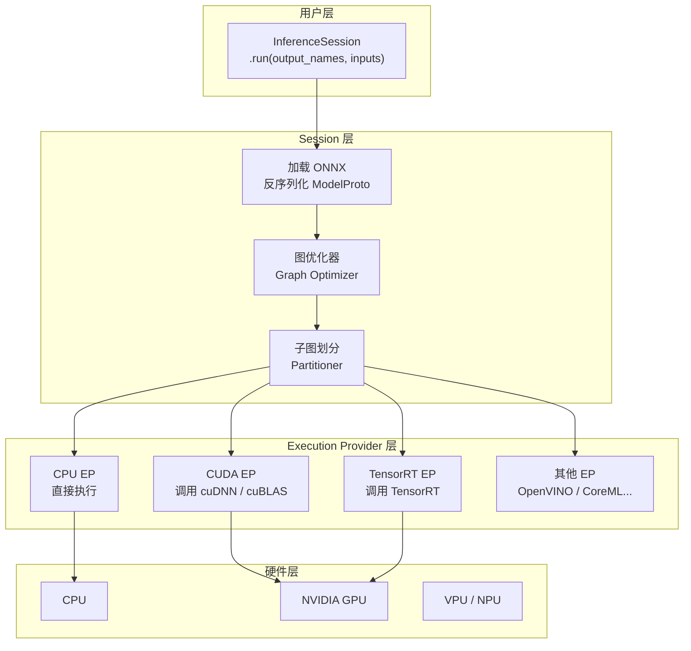
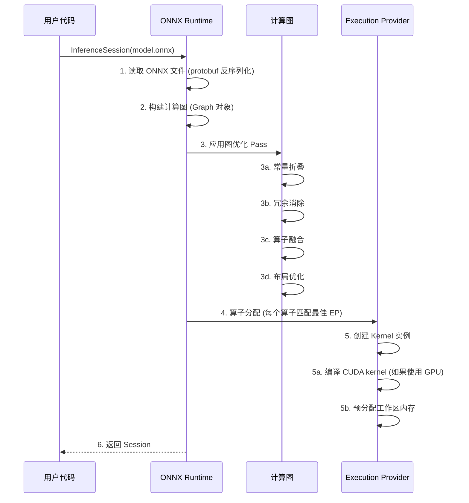
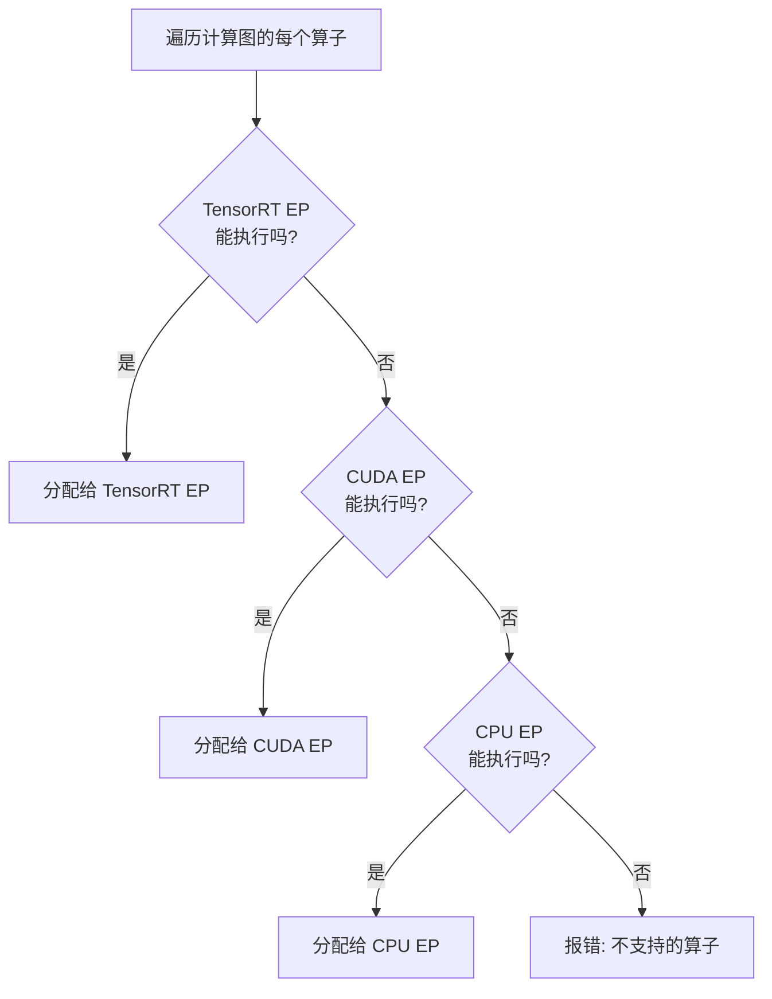
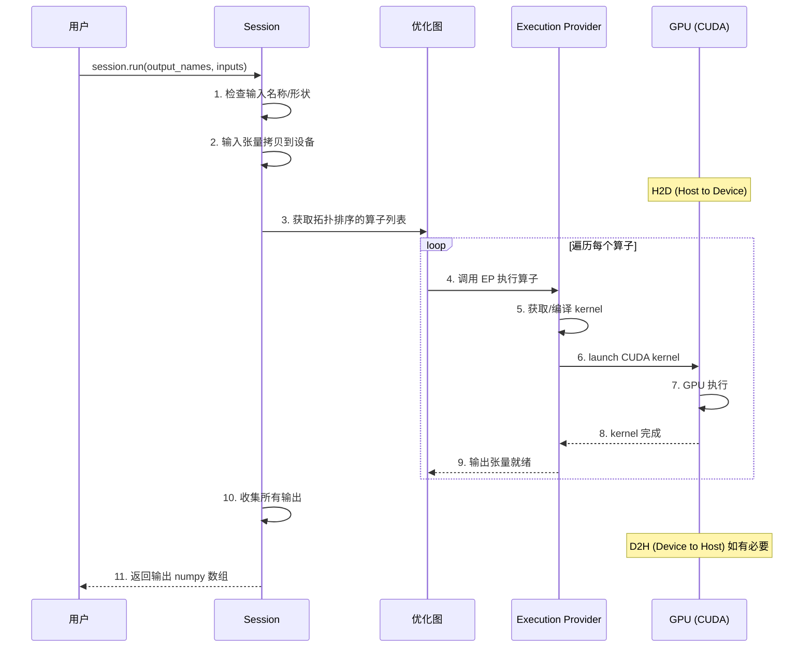

# 模型推理与 ONNX Runtime 详解

> 深入理解 `session.run()` 的每一层，从 API 到底层硬件执行。

---

## 目录

1. [ONNX Runtime 整体架构](#1-onnx-runtime-整体架构)
2. [Session 的创建过程](#2-session-的创建过程)
3. [Execution Provider 机制](#3-execution-provider-机制)
4. [session.run() 内部执行流程](#4-sessionrun-内部执行流程)
5. [图优化详解](#5-图优化详解)
6. [代码逐行解释](#6-代码逐行解释)
7. [性能调优指南](#7-性能调优指南)
8. [常见问题与调试](#8-常见问题与调试)

---

## 1. ONNX Runtime 整体架构



### 1.1 核心抽象

```
ONNX Runtime  =  图解释器 + 算子调度器 + EP 抽象层
                      ↑                ↑
                负责图优化和遍历     负责硬件加速
```

**关键认知**：ONNX Runtime 本身**不实现任何算子计算**。所有计算都委托给 Execution Provider。

---

## 2. Session 的创建过程

`ort.InferenceSession(model_path)` 背后做了大量的"编译"工作：



### 2.1 创建时间

```python
import onnxruntime as ort
import time

t0 = time.perf_counter()
session = ort.InferenceSession("model.onnx", providers=["CPUExecutionProvider"])
print(f"Session 创建耗时: {(time.perf_counter() - t0)*1000:.1f} ms")
# 输出: Session 创建耗时: 312.5 ms

# 创建一次后可以反复使用
for _ in range(100):
    session.run(None, {"images": input_tensor})  # 很快
```

> **⚠️ 关键教训**: Session 创建很慢（包含图优化 + kernel 编译），应创建一次，**全局复用**。

### 2.2 代码逐行解释

```python
import onnxruntime as ort

# ── 第1行: 创建 Session（实际由 load_model() 封装）──
session, input_name, output_name = load_model("best.onnx", "cpu")
# 等价于:
#   session = ort.InferenceSession("best.onnx", providers=["CPUExecutionProvider"])
#   input_name  = session.get_inputs()[0].name   → "images"
#   output_name = session.get_outputs()[0].name  → "output0"

# session 中包含:
#   session.get_inputs()   — 输入张量信息
#   session.get_outputs()  — 输出张量信息
#   session.get_providers()  — 可用的 EP 列表
#   session.get_provider_options()  — EP 配置
```

---

## 3. Execution Provider 机制

### 3.1 EP 优先级链

```python
# providers 列表的优先级:
#   [0] — 最高优先级
#   [-1] — 最低优先级 (通常为 CPU 兜底)

session = ort.InferenceSession("model.onnx", providers=[
    "TensorrtExecutionProvider",    # 最高优先: TensorRT
    "CUDAExecutionProvider",        # 次优先: CUDA
    "CPUExecutionProvider",         # 兜底: CPU
])
```

### 3.2 算子分配过程



```python
# 查看每个算子的分配情况
sess_options = ort.SessionOptions()
sess_options.enable_profiling = True
# ... create session, run, end profiling ...
# profiling 结果中包含每个算子的执行 Provider
```

### 3.3 EP 配置参数

```python
# TensorRT EP 详细配置
trt_options = {
    "device_id": 0,                 # GPU 设备编号
    "trt_max_workspace_size": 4 << 30,  # 最大工作区 (4GB)
    "trt_fp16_enable": True,        # 启用 FP16
    "trt_int8_enable": False,       # 不启用 INT8
    "trt_int8_calibration_table_name": "",  # INT8 校准表
    "trt_engine_cache_enable": True,       # 缓存编译后的 engine
    "trt_engine_cache_path": "./cache",    # 缓存路径
}

# CUDA EP 详细配置
cuda_options = {
    "device_id": 0,
    "arena_extend_strategy": "kNextPowerOfTwo",
    "cudnn_conv_algo_search": "EXHAUSTIVE",
}

session = ort.InferenceSession("model.onnx", providers=[
    ("TensorrtExecutionProvider", trt_options),
    ("CUDAExecutionProvider", cuda_options),
    "CPUExecutionProvider",
])
```

---

## 4. session.run() 内部执行流程



### 4.1 输入验证

```python
# session.run() 内部做的第一件事:
def _validate_inputs(inputs, input_names, expected_shapes):
    for name, tensor in inputs.items():
        # 1. 检查输入名称是否存在
        assert name in input_names, f"未知输入: {name}"

        # 2. 检查 dtype
        assert tensor.dtype == np.float32, "输入必须是 float32"

        # 3. 检查维度
        assert tensor.ndim == 4, "输入必须是 4-D 张量"

        # 4. 可选: 检查具体 shape 是否兼容
        # (部分模型有动态形状，不检查具体值)
```

### 4.2 内存拷贝

```python
# CPU → GPU 拷贝 (使用 CUDA EP 时)
# 内部调用: cudaMemcpyAsync(input_gpu, input_cpu, size, cudaMemcpyHostToDevice)

# GPU → CPU 拷贝 (输出)
# 内部调用: cudaMemcpyAsync(output_cpu, output_gpu, size, cudaMemcpyDeviceToHost)

# 这些拷贝是异步的，在 kernel launch 之间重叠执行
```

### 4.3 拓扑排序执行

```python
# 计算图是一个 DAG，算子按拓扑顺序执行
# 拓扑排序保证: 一个算子的所有输入都已准备好时，才执行该算子

# 伪代码:
def run_graph(session, inputs):
    ready_queue = find_ready_nodes(graph)  # 入度为 0 的节点
    while ready_queue:
        node = ready_queue.pop()
        ep = node.assigned_ep           # 分配好的 EP
        ep.compute(node, tensors)       # 执行
        for output_name in node.outputs:
            if all_predecessors_done(output_name):
                next_node = get_node_by_output(output_name)
                ready_queue.push(next_node)
```

---

## 5. 图优化详解

图优化是推理引擎最重要的加速手段之一，完全透明地在后台进行。

### 5.1 常量折叠 (Constant Folding)

```
优化前:                          优化后:
  Constant(1.0) ──┐               [直接替换为:
  Constant(2.0) ──┤── Add───      [3.0] 的常量张量]
                   │
  Input ───────────┘── Mul───     Input ── Mul(3.0)───

效果: 减少 2 个节点，消除运行时 overhead
```

### 5.2 算子融合 (Operator Fusion)

**这是最重要的优化**，将多个连续的小算子合并为一个融合 kernel：

```
优化前 (3次 kernel launch):
  Conv → BatchNormalization → Relu
  ↓       ↓                    ↓
  launch  launch              launch

优化后 (1次 kernel launch):
  ConvBNRelu  ← 自定义融合 kernel
  ↓
  launch (一次完成 Conv+BN+Relu)
```

**典型的融合模式：**

| 融合模式 | 加速效果 |
|---------|---------|
| Conv + BN + Relu → CBR | ~2-3x |
| Conv + Add + Relu | ~1.5x |
| LayerNorm + Relu | ~1.3x |
| 多个连续 Reshape/Transpose | 消除冗余 |
| Gelu 近似展开 | ~1.2x |

### 5.3 冗余消除 (Dead Code Elimination)

```python
# 如果某个输出从未被使用，删除产生该输出的算子
# 例如: 训练图中有 Dropout 但推理时未使用

# 优化前:                       优化后:
#   Input → Conv → Dropout → Relu    Input → Conv → Relu
#            ↑ 还有 BN 分支           ↑ 还有 BN 分支
#   Dropout 的输出只用于 Relu        Dropout 被删除
#   但 Relu 可以接受 Conv 的输出
```

### 5.4 布局优化 (Layout Optimization)

```python
# NCHW (默认) → NHWC (TensorRT 偏好)
# TensorRT 在 NHWC 布局下可以更好地利用 GPU tensor core

# 优化前: Conv(NCHW) → Transpose → Conv(NHWC)
# 优化后: Conv(NHWC) → Conv(NHWC)  (省去 Transpose)
```

### 5.5 关闭图优化（调试用）

```python
options = ort.SessionOptions()
options.graph_optimization_level = ort.GraphOptimizationLevel.ORT_DISABLE_ALL

session = ort.InferenceSession("model.onnx", options, ...)
```

---

## 6. 代码逐行解释

```python
def load_model(model_path: str, device: str = "cpu") -> tuple:
    """
    加载 ONNX 模型

    参数:
        model_path: ONNX 文件路径
        device:     "cpu" 或 "cuda" 或 "tensorrt"

    返回:
        session, input_name, output_name
    """
    # ────────────────────────────────────────────────
    # 第 1-3 行: 构建 EP 列表（优先级从高到低）
    # ────────────────────────────────────────────────
    providers = []

    # TensorRT: 最快的 NVIDIA 推理后端
    if device == "tensorrt":
        providers.append("TensorrtExecutionProvider")
        # TensorRT EP 会将 ONNX 图转换为 TensorRT engine
        # 首次运行会编译 CUDA kernel，后续缓存复用

    # CUDA: 使用 cuDNN/cuBLAS
    if device == "cuda":
        providers.append("CUDAExecutionProvider")
        # CUDA EP 直接调用 cuDNN 执行每个算子

    # CPU: 最后的兜底方案
    if device == "cpu":
        providers.append("CPUExecutionProvider")
    # CPU EP 使用 MKL (Intel) / Eigen 执行

    # ────────────────────────────────────────────────
    # 第 4 行: 创建 Session（图优化 + kernel 编译）
    # ────────────────────────────────────────────────
    session = ort.InferenceSession(model_path, providers=providers)
    # 这一行会:
    #   1. 读取并解析 ONNX protobuf 文件
    #   2. 构建计算图对象
    #   3. 应用图优化 Pass 列表
    #   4. 遍历算子，分配 EP
    #   5. 为每个算子创建 Kernel 对象

    # ────────────────────────────────────────────────
    # 第 5-8 行: 获取输入/输出元信息
    # ────────────────────────────────────────────────
    input_name = session.get_inputs()[0].name
    # 获取图中定义的第一个输入的名称
    # 对于 YOLO: "images"

    output_name = session.get_outputs()[0].name
    # 获取图中定义的第一个输出的名称
    # 对于 YOLO: "output0"

    # 打印模型信息
    print(f"input_name: {input_name}, output_name: {output_name}")

    return session, input_name, output_name


# ═══════════════════════════════════════════════════
#  推理执行（封装为 run 函数）
# ═══════════════════════════════════════════════════

def run(input_tensor: np.ndarray, session: ort.InferenceSession,
        input_name: str, output_name: str) -> np.ndarray:
    """
    执行单次推理

    参数:
        input_tensor:  预处理后的输入张量 (1, 3, 640, 640)
        session:       InferenceSession 对象
        input_name:    输入名称 (如 "images")
        output_name:   输出名称 (如 "output0")

    返回:
        模型输出的 numpy 数组
    """
    output = session.run([output_name], {input_name: input_tensor})[0]
    # session.run() 返回列表 list[np.ndarray]，[0] 取第一个输出
    # 即使使用 GPU EP，结果也会自动拷回 CPU 内存
    print(f"output.shape: {output.shape}")
    return output


# ── 第 1 步: 加载模型（只需一次）──
session, input_name, output_name = load_model("best.onnx", "cpu")

# ── 第 2 步: 预处理图像 ──
input_tensor, (pad_w, pad_h), scale = preprocess(image)
# input_tensor.shape = (1, 3, 640, 640)

# ── 第 3 步: 执行推理 ──
output = run(input_tensor, session, input_name, output_name)
# output.shape = (1, 84, 8400)   ← YOLOv8 输出格式
# 或 (1, 25200, 85)              ← YOLOv5 输出格式

# ── 第 4 步: 后处理 ──
detections = postprocess(output, scale, (pad_w, pad_h), image.shape)
# output:          (1, 84, 8400) 或 (1, 25200, 85) → 送后处理
```

### run 的三种调用方式

```python
# 方式 1: 直接调用 session.run（内联）
outputs = session.run(
    ["output0"],                    # 只获取 output0，返回列表
    {"images": input_tensor}
)
output_array = outputs[0]           # 从列表中取出 numpy 数组

# 方式 2: 使用 run() 包装函数（推荐，当前代码风格）
output = run(input_tensor, session, input_name, output_name)
# run() 内部自动取 [0]，直接返回 numpy 数组

# 方式 3: 获取所有输出
outputs = session.run(
    None,                           # None = 获取所有输出
    {"images": input_tensor}
)
# 对于多输出模型，按图中定义的顺序返回

# 方式 4: 多个输入/多个输出
outputs = session.run(
    ["output0", "output1"],         # 多个输出
    {"images": input_tensor, "other_input": other_tensor}  # 多个输入
)
```

---

## 7. 性能调优指南

### 7.1 Session 复用

```python
# ❌ 错误: 每帧重建 Session
def bad_inference(frame):
    session = ort.InferenceSession("model.onnx", providers=["CUDAExecutionProvider"])
    return run(preprocess(frame), session, "images", "output0")

# ✅ 正确: Session 全局复用
session, input_name, output_name = load_model("model.onnx", "cuda")

def good_inference(frame):
    input_tensor, _, _ = preprocess(frame)
    return run(input_tensor, session, input_name, output_name)
```

### 7.2 IO Binding（减少内存拷贝）

```python
# 默认: ONNX Runtime 管理内存，每次 run 都做 CPU↔GPU 拷贝
# IO Binding: 让用户管理内存，复用已分配的 GPU buffer

io_binding = session.io_binding()

# 将输入绑定到 GPU 内存
input_tensor_gpu = ort.OrtValue.ortvalue_from_numpy(input_tensor, "cuda", 0)
io_binding.bind_ortvalue_input("images", input_tensor_gpu)

# 将输出绑定到 GPU 内存
output_tensor_gpu = ort.OrtValue.ortvalue_from_shape_and_type(
    (1, 25200, 7), np.float32, "cuda", 0
)
io_binding.bind_ortvalue_output("output0", output_tensor_gpu)

# 推理（无内存拷贝）
session.run_with_iobinding(io_binding)

# 获取结果
result = output_tensor_gpu.numpy()  # 只在需要时才拷回 CPU
```

### 7.3 多线程推理

```python
# 一个 Session 可以创建多个 Execution Context
# 每个 Context 独立占用 GPU 内存，可以并行推理

options = ort.SessionOptions()
options.inter_op_num_threads = 2    # 算子间并行线程数
options.intra_op_num_threads = 4    # 算子内并行线程数

session = ort.InferenceSession("model.onnx", options, providers=["CPUExecutionProvider"])
```

### 7.4 Profiling

```python
options = ort.SessionOptions()
options.enable_profiling = True

session = ort.InferenceSession("model.onnx", options)
session.run(None, {"images": data})
prof_file = session.end_profiling()

# 查看 profiling 结果
import json
with open(prof_file) as f:
    prof = json.load(f)

# 按耗时降序排列
prof.sort(key=lambda x: x.get("dur", 0), reverse=True)
for entry in prof[:10]:
    print(f"{entry['name']:40s} {entry['dur']:>8.2f} us  {entry['cat']}")
```

---

## 8. 常见问题与调试

### 8.1 "Invalid provider" 错误

```
RuntimeError: Fail: Invalid Execution Provider: TensorrtExecutionProvider
```

**原因**：未安装对应的 ONNX Runtime 版本。

**解决**：
```bash
# CPU 版本 (默认)
pip install onnxruntime

# GPU 版本（带 CUDA EP）
pip install onnxruntime-gpu

# 查看已安装的版本包含了哪些 EP
python -c "import onnxruntime; print(onnxruntime.get_available_providers())"
```

### 8.2 "Unsupported operator" 错误

**原因**：ONNX Runtime 版本不支持某些算子（如更新版 PyTorch 导出了新版 ONNX 算子）。

**解决**：
```bash
# 1. 降低 opset 版本（重新导出）
torch.onnx.export(model, ..., opset_version=15)  # 使用较旧的 opset

# 2. 升级 ONNX Runtime
pip install onnxruntime-gpu --upgrade
```

### 8.3 Session 创建 OOM

**原因**：TensorRT EP 或 CUDA EP 在创建 Session 时会预分配显存。

**解决**：
```python
# 限制显存使用
cuda_options = {
    "device_id": 0,
    "arena_extend_strategy": "kNextPowerOfTwo",
    "gpu_mem_limit": 4 * 1024 * 1024 * 1024,  # 4GB
}
```

---

*本文配套代码: `src/onnx_detect_demo.py` 中的 `load_model()` 和推理主函数*
*上一步: `ONNX-4.预处理原理与代码详解.md` | 下一步: `ONNX-6.后处理YOLO解码与NMS详解.md`*
