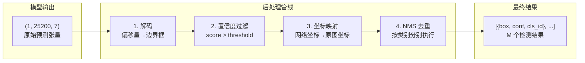
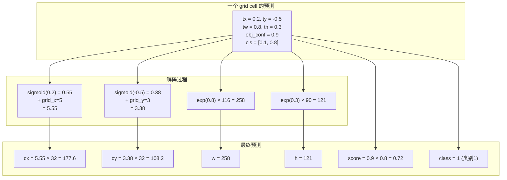
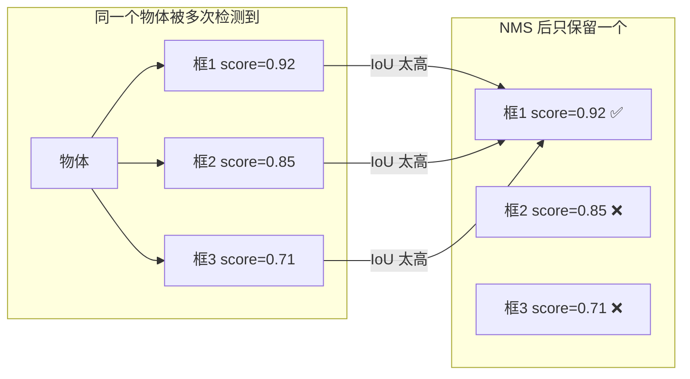
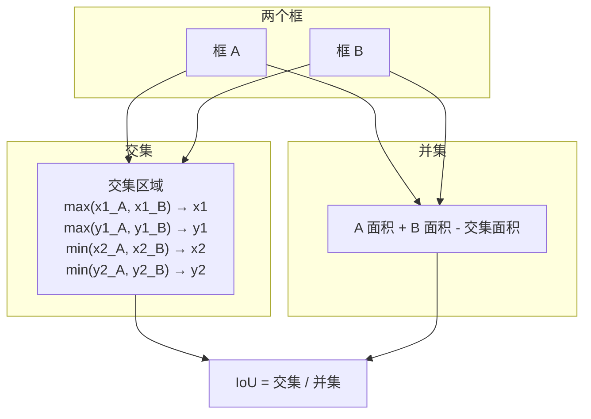

# 后处理：YOLO 解码与 NMS 详解

> 从 25200 个原始预测到最终的几个检测框——每一步的数学原理和代码实现。

---

## 目录

1. [后处理整体流程](#1-后处理整体流程)
2. [YOLO 检测原理](#2-yolo-检测原理)
3. [步骤一：输出解码](#3-步骤一输出解码)
4. [步骤二：置信度过滤](#4-步骤二置信度过滤)
5. [步骤三：坐标映射回原图](#5-步骤三坐标映射回原图)
6. [步骤四：NMS 非极大值抑制](#6-步骤四nms-非极大值抑制)
7. [完整代码逐行解释](#7-完整代码逐行解释)
8. [常见问题与调试](#8-常见问题与调试)

---

## 1. 后处理整体流程



**数据量变化：**

```
25200 个预测 ──→ 几百个候选框 ──→ 几十个最终检测

阶段       数量          说明
原始输出   25200         所有 grid × anchor
解码后     25200         转成可理解的坐标格式
过滤后     ~50-200       conf > 0.25 的保留
NMS 后     ~5-30         最终唯一的检测结果
```

---

## 2. YOLO 检测原理

### 2.1 什么是 Anchor？

YOLO 使用 **先验框（Anchor Box）** 作为检测的"模板"：

```
Anchor 是一组预定义的框大小:
  stride=8  (检测小物体):  (10×13), (16×30), (33×23)
  stride=16 (检测中物体):  (30×61), (62×45), (59×119)
  stride=32 (检测大物体):  (116×90), (156×198), (373×326)

这些尺寸是从训练数据中通过 K-Means 聚类得到的。
```

```mermaid
graph TD
    subgraph 输入图像 640×640
        A[图像]
    end

    subgraph stride=32 的网格 20×20
        B["每个 cell 负责检测<br>中心在该 cell 的物体"]
    end

    subgraph 每个 cell 的 3 个 anchor
        C["Anchor 1: (116×90)<br>Anchor 2: (156×198)<br>Anchor 3: (373×326)"]
    end

    A --> B
    B --> C
```

### 2.2 输出张量的组织方式

```
输出 shape: [1, 25200, 7]
              │    │     │
              │    │     └── 每个 anchor 的 7 个预测值
              │    └──────── 所有 anchor 的总数
              └───────────── batch 维度

25200 = 3 个尺度的 anchor 之和
      = (80×80 + 40×40 + 20×20) × 3 anchor
    
每个 anchor 的 7 个值:
  [tx, ty, tw, th, obj_conf, cls_1, cls_2]
```

**输出在内存中的排列：**

```
索引 0 ~ 19199:  stride=8  (80×80×3 = 19200)
  索引 0 ~ 6399:   grid[0,0] ~ grid[79,79], anchor 0
  索引 6400 ~ 12799: grid[0,0] ~ grid[79,79], anchor 1
  索引 12800 ~ 19199: grid[0,0] ~ grid[79,79], anchor 2

索引 19200 ~ 23999:  stride=16 (40×40×3 = 4800)
  索引 19200 ~ 20799: grid[0,0] ~ grid[39,39], anchor 0
  索引 20800 ~ 22399: grid[0,0] ~ grid[39,39], anchor 1
  索引 22400 ~ 23999: grid[0,0] ~ grid[39,39], anchor 2

索引 24000 ~ 25199:  stride=32 (20×20×3 = 1200)
  索引 24000 ~ 24399: grid[0,0] ~ grid[19,19], anchor 0
  索引 24400 ~ 24799: grid[0,0] ~ grid[19,19], anchor 1
  索引 24800 ~ 25199: grid[0,0] ~ grid[19,19], anchor 2
```

### 2.3 解码公式的推导

原始输出 `[tx, ty, tw, th]` 是**偏移量**，需要解码：

```
预测的中心点坐标 (在网格坐标系中):
  cx_pred = (sigmoid(tx) + grid_x) × stride
  cy_pred = (sigmoid(ty) + grid_y) × stride

预测的宽高:
  w_pred = exp(tw) × anchor_w × stride
  h_pred = exp(th) × anchor_h × stride
```

**为什么用 sigmoid 处理 tx/ty？**

```
sigmoid 将任意实数映射到 (0, 1) 区间

grid cell 的坐标范围是 [0, grid_size-1]
sigmoid(tx) ∈ (0, 1) 确保预测的中心点
始终在当前 cell 内部

如果不用 sigmoid:
  如果 tx = 10, 中心点会跑到 10 个 cell 之外
  导致训练不稳定
```

**为什么用 exp 处理 tw/th？**

```
exp 将任意实数映射到 (0, +∞)

宽高必须为正数
exp(tw) ∈ (0, +∞) 确保预测的宽高为正

如果 tw = 0 → exp(0) = 1 → 宽度 = anchor_w × stride
如果 tw = 1 → exp(1) = 2.718 → 宽度 = 2.718 × anchor_w × stride
```

---

## 3. 步骤一：输出解码

### 3.1 网格坐标生成

对于每个尺度，先生成网格坐标矩阵：

```python
# 以 stride=32, grid_size=20 为例:
grid_x, grid_y = np.meshgrid(np.arange(20), np.arange(20))

# grid_x:
#   [[ 0,  1,  2, ..., 19],
#    [ 0,  1,  2, ..., 19],
#    ...
#    [ 0,  1,  2, ..., 19]]     shape=(20, 20)

# grid_y:
#   [[ 0,  0,  0, ...,  0],
#    [ 1,  1,  1, ...,  1],
#    ...
#    [19, 19, 19, ..., 19]]     shape=(20, 20)

# 添加 anchor 维度:
grid_x = grid_x[..., np.newaxis]  # (20, 20, 1)
grid_y = grid_y[..., np.newaxis]  # (20, 20, 1)
# 最终: (20, 20, 1) 会在广播时扩展为 (20, 20, 3)
```

### 3.2 逐行解码

```python
def decode_yolov5_output(output, num_classes=2):
    """
    output: (25200, 7) — 单张图的原始输出

    逐行详解:
    """
    all_boxes, all_scores, all_class_ids = [], [], []
    grid_idx = 0

    # ── 对 3 个尺度的循环 ──
    for stride_idx, stride in enumerate(STRIDES):  # [8, 16, 32]
        grid_size = 640 // stride
        # grid_size: 80, 40, 20
        n = grid_size * grid_size * 3
        # n: 19200, 4800, 1200

        # ── 取出当前尺度的输出 ──
        scale_output = output[grid_idx:grid_idx + n]
        # shape: (n, 7)
        grid_idx += n

        # ── 重塑为网格格式 ──
        scale_output = scale_output.reshape(
            grid_size, grid_size, 3, -1
        )
        # shape: (grid_size, grid_size, 3, 7)
        # 维度: (y, x, anchor_idx, features)

        # ── 生成网格坐标 ──
        grid_x, grid_y = np.meshgrid(
            np.arange(grid_size), np.arange(grid_size)
        )
        # grid_x: (grid_size, grid_size), 每个元素的 x 坐标
        # grid_y: (grid_size, grid_size), 每个元素的 y 坐标
        grid_x = grid_x[..., np.newaxis]  # (g, g, 1)
        grid_y = grid_y[..., np.newaxis]  # (g, g, 1)

        # ── 当前尺度的 anchor ──
        anchors = ANCHORS[stride_idx] / stride
        # anchors: (3, 2), 归一化到网格尺寸
        # stride=8:  [[1.25, 1.625], [2.0, 3.75], [4.125, 2.875]]
        # stride=32: [[3.625, 2.8125], [4.875, 6.1875], [11.65625, 10.1875]]

        # ── 分离各分量 ──
        cx_raw  = scale_output[..., 0]  # (g, g, 3)
        cy_raw  = scale_output[..., 1]  # (g, g, 3)
        w_raw   = scale_output[..., 2]  # (g, g, 3)
        h_raw   = scale_output[..., 3]  # (g, g, 3)
        obj_conf = scale_output[..., 4]  # (g, g, 3)
        cls_scores = scale_output[..., 5:]  # (g, g, 3, num_classes)

        # ── 解码 ──
        # sigmoid(tx) + grid_x → 相对于网格的偏移 → × stride → 像素坐标
        cx = (sigmoid(cx_raw) + grid_x) * stride
        # sigmoid(ty) + grid_y → 相对于网格的偏移 → × stride → 像素坐标
        cy = (sigmoid(cy_raw) + grid_y) * stride
        # exp(tw) × anchor_w → 实际宽度 → × stride → 像素宽度
        w  = np.exp(w_raw) * anchors[:, 0] * stride
        # exp(th) × anchor_h → 实际高度 → × stride → 像素高度
        h  = np.exp(h_raw) * anchors[:, 1] * stride

        # ── 中心宽高 → 左上角右下角 ──
        # 后处理用 (x1, y1, x2, y2) 更方便
        x1 = cx - w / 2
        y1 = cy - h / 2
        x2 = cx + w / 2
        y2 = cy + h / 2

        # ── 展平 ──
        boxes = np.stack([x1, y1, x2, y2], axis=-1)
        # (g, g, 3, 4) → (g*g*3, 4)
        boxes = boxes.reshape(-1, 4)

        # ── 最终置信度 ──
        # obj_conf 是"该位置有物体"的概率
        # max(cls) 是"该物体是某类"的概率
        # 两者相乘得到最终置信度
        max_cls = cls_scores.reshape(-1, num_classes).max(axis=-1)
        final_scores = obj_conf.reshape(-1) * max_cls

        # ── 类别 ID ──
        class_ids = cls_scores.reshape(-1, num_classes).argmax(axis=-1)

        all_boxes.append(boxes)
        all_scores.append(final_scores)
        all_class_ids.append(class_ids)

    # ── 合并 3 个尺度的结果 ──
    boxes     = np.concatenate(all_boxes, axis=0)      # (25200, 4)
    scores    = np.concatenate(all_scores, axis=0)     # (25200,)
    class_ids = np.concatenate(all_class_ids, axis=0)  # (25200,)

    return boxes, scores, class_ids
```

### 3.3 解码的可视化理解



---

## 4. 步骤二：置信度过滤

解码后我们得到了 25200 个框，其中绝大部分是背景。用置信度阈值快速过滤：

```python
def filter_by_confidence(
    boxes: np.ndarray,      # (25200, 4)
    scores: np.ndarray,     # (25200,)
    class_ids: np.ndarray,  # (25200,)
    conf_threshold: float = 0.25,
):
    """
    保留置信度 > 阈值的检测结果
    """
    # 布尔掩码
    mask = scores > conf_threshold
    # mask: (25200,) 的 bool 数组
    # 例如: [False, False, True, False, True, ...]

    # 用掩码筛选
    boxes = boxes[mask]
    scores = scores[mask]
    class_ids = class_ids[mask]

    # 结果示例:
    #   boxes:     (183, 4)  ← 25200 中只有 183 个 > 0.25
    #   scores:    (183,)
    #   class_ids: (183,)

    return boxes, scores, class_ids
```

**阈值选择的影响：**

| 阈值 | 保留数量 | 效果 |
|:----:|:--------:|------|
| 0.1  | ~500+    | 很多误检 |
| 0.25 | ~50-200  | 推荐值，平衡精度和召回 |
| 0.5  | ~10-50   | 高精度但可能漏检 |
| 0.7  | ~0-10    | 只保留最高置信度的检测 |

---

## 5. 步骤三：坐标映射回原图

预处理时做了 LetterBox，检测到的坐标是在 **640×640 的填充图像** 上的。需要映射回原始图像坐标系。

### 5.1 逆映射公式

```mermaid
graph TD
    subgraph 640×640 坐标系（填充后）
        A["框在填充图上"]
    end

    A -->|"x -= pad_w<br>y -= pad_h"| B["去掉填充区域"]

    B -->|"x /= scale<br>y /= scale"| C["恢复到原始分辨率"]

    C -->|"clip(0, orig_w/h)"| D["裁剪到图像边界"]
```

```python
def map_to_original(
    boxes: np.ndarray,      # (N, 4) 在 640×640 坐标系中
    scale: float,           # 缩放比例，来自 preprocess
    pad: tuple,             # (pad_w, pad_h)，来自 preprocess
    image_shape: tuple,     # (orig_h, orig_w)
):
    pad_w, pad_h = pad
    orig_h, orig_w = image_shape[:2]

    # 步骤 1: 减去填充量（去掉 LetterBox 的灰色边框）
    boxes[:, [0, 2]] -= pad_w  # x1, x2
    boxes[:, [1, 3]] -= pad_h  # y1, y2

    # 步骤 2: 除以缩放比例（恢复到原始分辨率）
    boxes[:, [0, 2]] /= scale  # x1, x2
    boxes[:, [1, 3]] /= scale  # y1, y2

    # 步骤 3: 裁剪到图像边界（防止越界）
    boxes[:, [0, 2]] = np.clip(boxes[:, [0, 2]], 0, orig_w)
    boxes[:, [1, 3]] = np.clip(boxes[:, [1, 3]], 0, orig_h)

    # 步骤 4: 转换为整数像素坐标（可选）
    # boxes = np.round(boxes).astype(np.int32)

    return boxes
```

### 5.2 为什么要有 Step 3（裁剪）？

```
原始图像: 1920×1080
scale = 0.333, pad = (0, 140)

解码时，框可能在图像有效区域之外（因为 padding 区域被识别为背景，
但靠近边界的物体产生的框可能越界）。

clip 确保:
  x1, x2 ∈ [0, 1920]
  y1, y2 ∈ [0, 1080]
```

---

## 6. 步骤四：NMS 非极大值抑制

### 6.1 为什么需要 NMS？



### 6.2 IoU 计算

```python
def compute_iou(box: np.ndarray, boxes: np.ndarray) -> np.ndarray:
    """
    计算一个框与一组框的 IoU (Intersection over Union)

    IoU = 两个框交集面积 / 两个框并集面积
    IoU ∈ [0, 1]

    参数:
        box:   [4]       — 单个框 (x1, y1, x2, y2)
        boxes: [N, 4]    — N 个框

    返回:
        ious:  [N]       — 每个 IoU 值
    """
```



```python
def compute_iou(box, boxes):
    # ── 第1行: 交集区域的左上角 ──
    x1 = np.maximum(box[0], boxes[:, 0])
    y1 = np.maximum(box[1], boxes[:, 1])
    # 取两个框左上角的最大值作为交集的左上角

    # ── 第2行: 交集区域的右下角 ──
    x2 = np.minimum(box[2], boxes[:, 2])
    y2 = np.minimum(box[3], boxes[:, 3])
    # 取两个框右下角的最小值作为交集的右下角

    # ── 第3行: 计算交集面积 ──
    inter = np.maximum(0, x2 - x1) * np.maximum(0, y2 - y1)
    # np.maximum(0, ...) 确保不相交时面积为 0（不会变负）

    # ── 第4行: 计算两个框各自面积 ──
    area1 = (box[2] - box[0]) * (box[3] - box[1])   # 框 A 面积
    area2 = (boxes[:, 2] - boxes[:, 0]) * (boxes[:, 3] - boxes[:, 1])  # 框 B 面积

    # ── 第5行: 并集 = A + B - 交集 ──
    union = area1 + area2 - inter

    # ── 第6行: IoU = 交集 / 并集（避免除零） ──
    return np.where(union > 0, inter / union, 0)
```

**IoU 示例值：**

```
IoU = 0.95  → 几乎完全重合，肯定重复
IoU = 0.60  → 高度重叠，可能是同一物体
IoU = 0.30  → 部分重叠，可能是不同物体
IoU = 0.00  → 完全不重叠，不同物体
```

### 6.3 NMS 算法实现

```python
def nms(
    boxes: np.ndarray,        # (N, 4)
    scores: np.ndarray,       # (N,)
    iou_threshold: float = 0.45,
):
    """
    非极大值抑制 — 核心算法

    算法步骤:
      1. 按置信度降序排列
      2. 取最高分框，加入保留列表
      3. 计算该框与所有剩余框的 IoU
      4. 删除 IoU > 阈值的框
      5. 重复 2-4

    参数:
        boxes:  [N, 4]  边界框
        scores: [N]     置信度
        iou_threshold:  当两个框的 IoU > 此值，视为冗余

    返回:
        list[int]: 保留的框索引
    """
    # ── 第1行: 按置信度降序排列 ──
    order = np.argsort(scores)[::-1]
    # 例如 scores = [0.3, 0.9, 0.6, 0.8]
    # argsort → [1, 3, 2, 0] (升序)
    # [::-1]  → [0, 2, 3, 1] (降序) ← 最高分索引在前

    keep = []  # 保留的框索引

    while len(order) > 0:
        # ── 第2行: 取当前最高分的框 ──
        i = order[0]
        keep.append(i)

        if len(order) == 1:
            break

        # ── 第3行: 计算与剩余框的 IoU ──
        ious = compute_iou(boxes[i], boxes[order[1:]])

        # ── 第4行: 只保留 IoU ≤ 阈值的框 ──
        mask = ious < iou_threshold
        # 例如: ious = [0.9, 0.3, 0.1, 0.8]
        # mask = [False, True, True, False]
        order = order[1:][mask]
        # order[1:] 跳过当前框
        # [mask] 只保留 IoU 小的框

    return keep
```

**NMS 执行过程示例：**

```
初始 scores: [0.95, 0.90, 0.85, 0.70, 0.65]
对应框:     [  A,    B,    C,    D,    E  ]
IoU 阈值:  0.45

第1轮:
  选中 A (0.95)
  计算 A 与 [B,C,D,E] 的 IoU: [0.80, 0.10, 0.05, 0.90]
  保留 IoU ≤ 0.45: [C, D]  (B和E被删除)
  剩余: [C(0.85), D(0.70)]

第2轮:
  选中 C (0.85)
  计算 C 与 [D] 的 IoU: [0.20]
  保留 IoU ≤ 0.45: [D]
  剩余: [D(0.70)]

第3轮:
  选中 D (0.70)
  没有剩余框了

结果: 保留 A, C, D
```

### 6.4 按类别分别做 NMS

不同类别的物体即使框重叠也不应该被抑制，所以需要**按类别分别做 NMS**：

```python
def postprocess(output, scale, pad, image_shape, ...):
    # ... 解码和过滤 ...

    # 按类别分别做 NMS
    final_detections = []

    for cls_id in np.unique(class_ids):
        # 选出当前类别的框
        cls_mask = class_ids == cls_id
        cls_boxes = boxes[cls_mask]
        cls_scores = scores[cls_mask]

        # 当前类别单独做 NMS
        keep = nms(cls_boxes, cls_scores, iou_threshold)

        for idx in keep:
            final_detections.append({
                "box": cls_boxes[idx].tolist(),
                "conf": float(cls_scores[idx]),
                "class_id": int(cls_id),
            })

    # 按置信度降序排列
    final_detections.sort(key=lambda x: x["conf"], reverse=True)
    return final_detections
```

---

## 7. 完整代码逐行解释

```python
def postprocess(
    output: np.ndarray,        # (25200, 7) 原始输出
    scale: float,               # 预处理时的缩放比例
    pad: tuple,                 # (pad_w, pad_h)
    image_shape: tuple,         # (H, W) 原始图像尺寸
    conf_threshold: float = 0.25,
    iou_threshold: float = 0.45,
    num_classes: int = 2,
) -> list[dict]:
    """
    完整后处理管线
    """

    # ════════════════════════════════════════════
    #  第 1 步: YOLO 解码
    # ════════════════════════════════════════════
    # 输入: output (25200, 7) — 原始偏移量
    # 输出: boxes (25200, 4) — x1,y1,x2,y2 在 640×640 坐标系
    #       scores (25200,)  — 最终置信度
    #       class_ids (25200,) — 类别索引
    boxes, scores, class_ids = decode_yolov5_output(
        output, num_classes
    )

    # ════════════════════════════════════════════
    #  第 2 步: 置信度过滤
    # ════════════════════════════════════════════
    # 保留 score > threshold 的框
    # 25200 → 通常 ~50-200 个
    mask = scores > conf_threshold
    boxes = boxes[mask]
    scores = scores[mask]
    class_ids = class_ids[mask]

    if len(boxes) == 0:
        return []  # 没有检测到任何物体

    # ════════════════════════════════════════════
    #  第 3 步: 坐标映射回原图
    # ════════════════════════════════════════════
    # 从 640×640 坐标系 → 原始图像坐标系
    pad_w, pad_h = pad
    orig_h, orig_w = image_shape[:2]

    # 减去 LetterBox 填充
    boxes[:, [0, 2]] = (boxes[:, [0, 2]] - pad_w) / scale
    boxes[:, [1, 3]] = (boxes[:, [1, 3]] - pad_h) / scale

    # 裁剪到图像边界，防止越界
    boxes[:, [0, 2]] = np.clip(boxes[:, [0, 2]], 0, orig_w)
    boxes[:, [1, 3]] = np.clip(boxes[:, [1, 3]], 0, orig_h)

    # ════════════════════════════════════════════
    #  第 4 步: NMS
    # ════════════════════════════════════════════
    final_detections = []

    # 按类别分别处理
    for cls_id in np.unique(class_ids):
        # 选出当前类别的框
        cls_mask = class_ids == cls_id
        cls_boxes = boxes[cls_mask]
        cls_scores = scores[cls_mask]

        # NMS
        keep = nms(cls_boxes, cls_scores, iou_threshold)

        # 收集结果
        for idx in keep:
            final_detections.append({
                "box": cls_boxes[idx].tolist(),
                "conf": float(cls_scores[idx]),
                "class_id": int(cls_id),
            })

    # 按置信度降序排列，最有把握的排最前
    final_detections.sort(key=lambda x: x["conf"], reverse=True)

    return final_detections
```

---

## 8. 常见问题与调试

### 8.1 完全没有检测结果

**排查步骤：**

```python
# 1. 检查解码前的原始输出值范围
outputs = session.run(None, {"images": input_tensor})
raw = outputs[0][0]  # (25200, 7)
print(f"tx 范围: [{raw[:, 0].min():.2f}, {raw[:, 0].max():.2f}]")
print(f"obj_conf 范围: [{raw[:, 4].min():.2f}, {raw[:, 4].max():.2f}]")
# 如果 obj_conf 最大值 < 0.1，说明模型输出有问题

# 2. 测试降低置信度阈值
detections = postprocess(raw, scale, pad, image_shape, conf_threshold=0.01)
# 如果能检测到，说明阈值太高

# 3. 检查类别数是否匹配
# 你的模型是 2 类，确保 num_classes=2
```

### 8.2 框位置偏移

**排查步骤：**

```python
# 1. 确认预处理和后处理的 scale/pad 值一致
print(f"预处理 scale: {scale}, pad: {pad}")

# 2. 确认坐标映射公式正确
# 预处理: scale = min(640/w, 640/h)
# 后处理: x = (x - pad_w) / scale  ✅
#        x = x / scale - pad_w     ❌ (顺序错了)
```

### 8.3 大量重复框

**排查步骤：**

```python
# 1. 检查 NMS 是否按类别分别执行
# 如果不按类别，不同类别的框也会互相抑制

# 2. 检查 IoU 阈值
nms(..., iou_threshold=0.45)  # 值越大，保留越多框
# 0.45 → 适中
# 0.70 → 宽松（可能有重复）
# 0.20 → 严格（可能漏检）

# 3. 检查坐标是否在同一坐标系下
# NMS 前要确保所有框都在原图坐标系
```

### 8.4 后处理性能优化

后处理（特别是 NMS）在 CPU 上可能成为瓶颈：

```python
# 优化 1: 提前过滤，减少 NMS 处理的框数
# 提高 conf_threshold: 0.25 → 0.5 (减少 90% 的框)

# 优化 2: 向量化 IoU 计算
# 上面的 compute_iou 已经是向量化的

# 优化 3: 使用 torchvision.ops.nms（GPU 加速）
import torch
from torchvision.ops import nms as torch_nms

boxes_t = torch.from_numpy(boxes).cuda()
scores_t = torch.from_numpy(scores).cuda()
keep = torch_nms(boxes_t, scores_t, 0.45).cpu().numpy()
# GPU NMS 比 CPU 快 10-100x

# 优化 4: 使用 ONNX Runtime 的 NMS 插件
# 有些模型导出时已经包含了 NMS 节点，不需要手动实现
```

---

*本文配套代码: `src/onnx_detect_demo.py` 中的 `decode_yolov5_output()`、`nms()`、`postprocess()`*
*上一步: `ONNX-5.模型推理与ONNX Runtime详解.md` | 下一步: `ONNX-7.检测结果可视化详解.md`*
