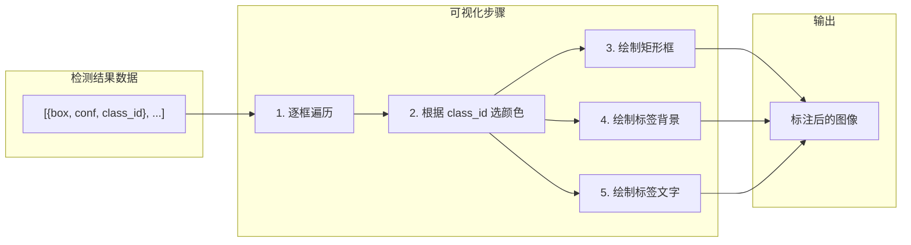
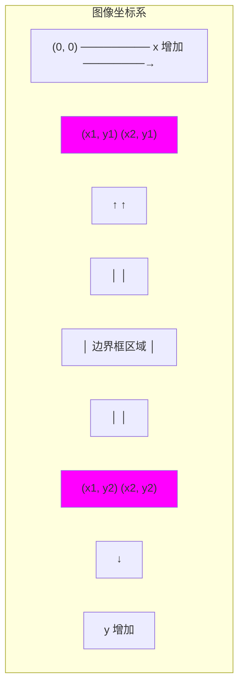

# 检测结果可视化详解

> 从数据到图像——将检测框、标签、置信度绘制到图像上的完整技术。

---

## 目录

1. [可视化整体流程](#1-可视化整体流程)
2. [OpenCV 绘图基础](#2-opencv-绘图基础)
3. [绘制边界框](#3-绘制边界框)
4. [绘制标签文字](#4-绘制标签文字)
5. [颜色方案](#5-颜色方案)
6. [完整代码逐行解释](#6-完整代码逐行解释)
7. [高级可视化技巧](#7-高级可视化技巧)

---

## 1. 可视化整体流程



**输入输出：**

```
输入: 原始图像 (H, W, 3) + 检测结果列表
输出: 标注图像 (H, W, 3) — 带框和标签
```

---

## 2. OpenCV 绘图基础

### 2.1 坐标系

OpenCV 的坐标系**原点在左上角**：



### 2.2 核心绘图函数

```python
import cv2
import numpy as np

# ── cv2.rectangle: 绘制矩形 ──
cv2.rectangle(
    img,            # 图像 (会被原地修改!)
    (x1, y1),       # 左上角坐标
    (x2, y2),       # 右下角坐标
    color,          # BGR 颜色元组 (255, 0, 0)=蓝色
    thickness=2,    # 线宽 (-1=填充)
)

# ── cv2.putText: 绘制文字 ──
cv2.putText(
    img,            # 图像
    text,           # 字符串 "cat 0.95"
    (x, y),         # 文字左下角坐标
    font,           # 字体 (如 cv2.FONT_HERSHEY_SIMPLEX)
    font_scale,     # 字体大小 (如 0.6)
    color,          # 文字颜色 (255, 255, 255)=白色
    thickness=2,    # 文字粗细
    lineType=cv2.LINE_AA,  # 抗锯齿
)

# ── cv2.getTextSize: 获取文字尺寸 ──
(text_width, text_height), baseline = cv2.getTextSize(
    text, font, font_scale, thickness
)
# 用于计算标签背景框的大小
```

---

## 3. 绘制边界框

### 3.1 基础框绘制

```python
def draw_box(img, x1, y1, x2, y2, color, thickness=2):
    """在图像上绘制检测框"""
    cv2.rectangle(
        img,
        (int(x1), int(y1)),  # 左上角
        (int(x2), int(y2)),  # 右下角
        color,
        thickness,
        lineType=cv2.LINE_AA,  # 抗锯齿，更平滑
    )
```

**`thickness` 参数的效果：**

```
thickness = 1  ──  细线
thickness = 2  ──  标准线宽（推荐）
thickness = 3  ──  粗线
thickness = -1 ──  填充整个矩形
```

### 3.2 不同风格的框

```python
def draw_box_fancy(img, x1, y1, x2, y2, color, thickness=2):
    """绘制更美观的框（圆角+高亮角标）"""
    # 方法 1: 圆角矩形（需要轮廓绘制）
    h, w = y2 - y1, x2 - x1
    r = min(h, w) // 8  # 圆角半径
    # 用 cv2.drawContours 绘制圆角矩形

    # 方法 2: 角标（左上角+右下角加粗）
    corner_len = min(h, w) // 6
    # 左上角
    cv2.line(img, (x1, y1), (x1 + corner_len, y1), color, thickness)
    cv2.line(img, (x1, y1), (x1, y1 + corner_len), color, thickness)
    # 右下角
    cv2.line(img, (x2, y2), (x2 - corner_len, y2), color, thickness)
    cv2.line(img, (x2, y2), (x2, y2 - corner_len), color, thickness)

    # 方法 3: 虚线框
    # 用 cv2.line 配合循环绘制虚线
```

---

## 4. 绘制标签文字

### 4.1 标签的结构

```
┌──────────────────────┐
│  person 0.95         │  ← 标签文字
└──────────────────────┘
  ↑
  框的左上角 y1

标签 = "类别名 置信度"
```

### 4.2 标签背景框

为了让标签在任何背景上都清晰可读，先绘制一个实心背景矩形，再在上面写文字：

```python
def draw_label(img, x1, y1, text, color):
    """
    在 (x1, y1) 位置绘制标签（背景 + 文字）

    ┌──────────────┐  ← 背景矩形
    │  person 0.95 │
    └──────────────┘
    ↑
    (x1, y1)  ← 框的左上角
    """
    # ── 第1步: 获取文字的尺寸 ──
    font = cv2.FONT_HERSHEY_SIMPLEX
    font_scale = 0.6
    thickness = 2

    (text_w, text_h), baseline = cv2.getTextSize(
        text, font, font_scale, thickness
    )
    # text_w: 文字的像素宽度
    # text_h: 文字的像素高度
    # baseline: 文字基线到底部的距离

    # ── 第2步: 计算背景矩形的位置 ──
    # 背景在文字周围留出 4px 内边距
    pad = 4
    bg_x1 = x1
    bg_y1 = y1 - text_h - pad * 2  # 文字在框的上方
    bg_x2 = x1 + text_w + pad * 2
    bg_y2 = y1

    # ── 第3步: 绘制实心背景 ──
    cv2.rectangle(
        img,
        (bg_x1, bg_y1),
        (bg_x2, bg_y2),
        color,
        thickness=-1,  # -1 = 填充
    )

    # ── 第4步: 在背景上写白色文字 ──
    cv2.putText(
        img,
        text,
        (x1 + pad, y1 - pad),  # 文字左下角坐标
        font,
        font_scale,
        (255, 255, 255),  # 白色文字
        thickness,
        lineType=cv2.LINE_AA,
    )
```

**坐标系详细计算：**

```
假设: y1 = 100, text_h = 20, pad = 4

背景框:
  bg_y1 = 100 - 20 - 8 = 72  ← 文字上方 + 内边距
  bg_y2 = 100               ← 与框顶对齐

文字位置:
  y = y1 - pad = 96  ← 背景框内，底部留 4px padding

可视化:
  72  ┌──────────────────┐
  76  │  person 0.95     │
  96  └──────────────────┘
  100 ──────────────────────  ← 矩形框的顶部 (y1)
```

### 4.3 文字在框下方的情况

当框顶部靠近图像边缘时，标签会超出画面：

```python
def draw_label_safe(img, x1, y1, x2, y2, text, color):
    """
    安全绘制标签——如果上方空间不足，放在框下方
    """
    # 检查标签是否会超出图像顶部
    font = cv2.FONT_HERSHEY_SIMPLEX
    (text_w, text_h), _ = cv2.getTextSize(text, font, 0.6, 2)
    pad = 4
    bg_height = text_h + pad * 2

    if y1 - bg_height > 0:
        # 空间充足 → 放在框上方
        bg_x1, bg_y1 = x1, y1 - bg_height
        text_x, text_y = x1 + pad, y1 - pad
    else:
        # 空间不足 → 放在框下方
        bg_x1, bg_y1 = x1, y2
        text_x, text_y = x1 + pad, y2 + text_h + pad

    # 绘制背景
    cv2.rectangle(img, (bg_x1, bg_y1), (bg_x1 + text_w + pad * 2, bg_y1 + bg_height), color, -1)
    # 绘制文字
    cv2.putText(img, text, (text_x, text_y), font, 0.6, (255, 255, 255), 2, cv2.LINE_AA)
```

---

## 5. 颜色方案

### 5.1 基于类别 ID 的固定颜色

```python
# 为每个类别分配不同的颜色
COLORS = [
    (255, 0, 0),      # 0: 蓝色
    (0, 255, 0),      # 1: 绿色
    (0, 0, 255),      # 2: 红色
    (255, 255, 0),    # 3: 青色
    (255, 0, 255),    # 4: 紫色
    (0, 255, 255),    # 5: 黄色
    (128, 0, 0),      # 6: 深蓝
    (0, 128, 0),      # 7: 深绿
    (0, 0, 128),      # 8: 深红
]

def get_color(class_id):
    return COLORS[class_id % len(COLORS)]
```

### 5.2 HSV 均匀分布颜色

如果类别很多（如 COCO 80 类），可以用 HSV 空间均匀生成：

```python
def get_color_hsv(class_id, num_classes=80):
    """
    在 HSV 空间中均匀分配颜色，保证视觉上可区分

    HSV:
      H (色相): 0-179  — 颜色种类
      S (饱和度): 0-255  — 颜色纯度
      V (明度): 0-255   — 亮度
    """
    hue = int(180 * class_id / num_classes)
    # H 值均匀分布在 0-179 之间
    color_hsv = np.array([[[hue, 255, 220]]], dtype=np.uint8)
    color_bgr = cv2.cvtColor(color_hsv, cv2.COLOR_HSV2BGR)
    return tuple(map(int, color_bgr[0, 0]))
```

### 5.3 随机颜色

```python
def get_color_random(seed=None):
    """生成随机颜色（保证足够亮）"""
    if seed is not None:
        np.random.seed(seed)
    while True:
        color = np.random.randint(50, 255, size=3).tolist()
        # 排除太暗的颜色 (亮度 < 50)
        if sum(color) > 300:  # 足够亮
            return tuple(color)
```

---

## 6. 完整代码逐行解释

```python
def draw_detections(
    image: np.ndarray,
    detections: list[dict],
    class_names: list[str] = None,
) -> np.ndarray:
    """
    在图像上绘制所有检测结果

    参数:
        image:       原始 BGR 图像, shape=(H, W, 3)
        detections:  检测结果列表
                     [{"box": [x1,y1,x2,y2], "conf": 0.95, "class_id": 0}, ...]
        class_names: 类别名称列表 ["person", "car", ...]

    返回:
        img: 标注后的图像（拷贝，不修改原图）
    """
    # ────────────────────────────────────────────────
    # 第 1 行: 创建副本，避免修改原始图像
    # ────────────────────────────────────────────────
    img = image.copy()
    # 因为 cv2.rectangle 和 cv2.putText 会原地修改图像
    # 如果不想破坏原始图像，必须 copy()

    # ────────────────────────────────────────────────
    # 第 2-3 行: 处理 None 值
    # ────────────────────────────────────────────────
    if class_names is None:
        class_names = [f"cls_{i}" for i in range(100)]

    # ────────────────────────────────────────────────
    # 第 4 行: 遍历每个检测结果
    # ────────────────────────────────────────────────
    for det in detections:
        # ── 4a. 提取检测数据 ──
        x1, y1, x2, y2 = map(int, det["box"])
        # map(int, ...) 确保坐标是整数
        # cv2.rectangle 要求整数坐标

        conf = det["conf"]
        cls_id = det["class_id"]

        # ── 4b. 构造标签文字 ──
        label = class_names[cls_id] if cls_id < len(class_names) else f"cls_{cls_id}"
        text = f"{label} {conf:.2f}"
        # 例如: "person 0.95"
        # conf:.2f 保留两位小数

        # ── 4c. 选择颜色 ──
        color = COLORS[cls_id % len(COLORS)]

        # ════════════════════════════════════════════
        #  绘制边界框
        # ════════════════════════════════════════════
        cv2.rectangle(
            img,
            (x1, y1),               # 左上角
            (x2, y2),               # 右下角
            color,                  # BGR 颜色
            2,                      # 线宽
            lineType=cv2.LINE_AA,   # 抗锯齿
        )

        # ════════════════════════════════════════════
        #  绘制标签（背景 + 文字）
        # ════════════════════════════════════════════

        # 第 1 步: 获取文字尺寸
        font = cv2.FONT_HERSHEY_SIMPLEX
        font_scale = 0.6
        thickness = 2
        (tw, th), _ = cv2.getTextSize(text, font, font_scale, thickness)
        # tw: 文字宽度, th: 文字高度

        # 第 2 步: 计算背景矩形位置
        pad = 4
        bg_x1 = x1
        bg_y1 = y1 - th - pad * 2  # 在框的上方
        bg_x2 = x1 + tw + pad * 2
        bg_y2 = y1

        # 第 3 步: 绘制实心背景
        cv2.rectangle(
            img,
            (bg_x1, bg_y1),
            (bg_x2, bg_y2),
            color,          # 与框同色
            -1,             # -1 填充整个矩形
        )

        # 第 4 步: 绘制白色文字
        cv2.putText(
            img,
            text,
            (x1 + pad, y1 - pad),   # 文字在背景框内
            font,
            font_scale,
            (255, 255, 255),        # 白色
            thickness,
            lineType=cv2.LINE_AA,
        )

    return img
```

---

## 7. 高级可视化技巧

### 7.1 半透明框

```python
def draw_alpha_box(img, x1, y1, x2, y2, color, alpha=0.3):
    """绘制半透明填充框"""
    overlay = img.copy()
    cv2.rectangle(overlay, (x1, y1), (x2, y2), color, -1)
    cv2.addWeighted(overlay, alpha, img, 1 - alpha, 0, img)
    # 叠加一层半透明颜色，凸显检测区域
```

### 7.2 置信度渐变颜色

```python
def conf_to_color(conf, min_conf=0.25, max_conf=1.0):
    """
    根据置信度映射颜色:
      低置信度 → 红色 (危险/不确定)
      高置信度 → 绿色 (安全/确定)
    """
    # 将 conf 归一化到 [0, 1]
    t = (conf - min_conf) / (max_conf - min_conf)
    t = np.clip(t, 0, 1)

    # 红色 (0, 0, 255) → 黄色 (0, 255, 255) → 绿色 (0, 255, 0)
    if t < 0.5:
        # 红 → 黄
        r, g, b = 255, int(255 * t * 2), 0
    else:
        # 黄 → 绿
        r, g, b = int(255 * (1 - t) * 2), 255, 0

    return (r, g, b)
```

### 7.3 ROI 裁剪与放大

```python
def draw_roi_zoom(img, detections, zoom_factor=2):
    """
    在图像右下角显示检测物体的放大图
    """
    h, w = img.shape[:2]
    roi_w, roi_h = w // 3, h // 3
    roi_x, roi_y = w - roi_w, h - roi_h

    if detections:
        # 取置信度最高的检测物体
        top_det = detections[0]
        x1, y1, x2, y2 = map(int, top_det["box"])

        # 裁剪并放大
        crop = img[y1:y2, x1:x2]
        if crop.size > 0:
            zoomed = cv2.resize(crop, (roi_w, roi_h), interpolation=cv2.INTER_LINEAR)
            img[roi_y:roi_y+roi_h, roi_x:roi_x+roi_w] = zoomed
            # 绘制放大区域边框
            cv2.rectangle(img, (roi_x, roi_y), (roi_x+roi_w, roi_y+roi_h), (255, 255, 255), 2)
    return img
```

### 7.4 信息叠加（帧率等）

```python
def draw_info(img, fps, num_detections, infer_time_ms):
    """在图像左上角显示推理信息"""
    info_lines = [
        f"FPS: {fps:.1f}",
        f"Detections: {num_detections}",
        f"Inference: {infer_time_ms:.1f}ms",
    ]

    for i, line in enumerate(info_lines):
        y = 30 + i * 30
        # 文字背景（便于阅读）
        (tw, th), _ = cv2.getTextSize(line, cv2.FONT_HERSHEY_SIMPLEX, 0.7, 2)
        cv2.rectangle(img, (5, y - th - 5), (5 + tw + 10, y + 5), (0, 0, 0), -1)
        cv2.putText(img, line, (10, y), cv2.FONT_HERSHEY_SIMPLEX, 0.7, (0, 255, 0), 2)
```

### 7.5 视频帧缓存与平滑

```python
class DetectionSmoother:
    """
    对视频流中的检测框做指数平滑，减少抖动
    """
    def __init__(self, alpha=0.3):
        self.alpha = alpha
        self.prev_boxes = {}  # class_id → box

    def smooth(self, detections):
        for det in detections:
            cls_id = det["class_id"]
            box = np.array(det["box"])

            if cls_id in self.prev_boxes:
                # 指数移动平均
                smoothed = (1 - self.alpha) * self.prev_boxes[cls_id] + self.alpha * box
                self.prev_boxes[cls_id] = smoothed
                det["box"] = smoothed.tolist()
            else:
                self.prev_boxes[cls_id] = box

        return detections
```

### 7.6 保存结果到文件

```python
# 保存单张图片
cv2.imwrite("result.jpg", result_img)

# 保存视频
fourcc = cv2.VideoWriter_fourcc(*"mp4v")
writer = cv2.VideoWriter("result.mp4", fourcc, fps, (w, h))

while True:
    ret, frame = cap.read()
    if not ret:
        break
    result_frame = draw_detections(frame, detections)
    writer.write(result_frame)  # 逐帧写入

writer.release()

# 保存结果到 JSON（供后续分析）
import json

results_json = []
for det in detections:
    results_json.append({
        "bbox": det["box"],
        "confidence": det["conf"],
        "class_id": det["class_id"],
        "class_name": CLASS_NAMES[det["class_id"]],
    })

with open("detections.json", "w") as f:
    json.dump(results_json, f, indent=2)
```

---

## 附录：完整可视化函数

```python
def draw_detections_full(
    image: np.ndarray,
    detections: list[dict],
    class_names: list[str],
    show_confidence: bool = True,
    box_thickness: int = 2,
    font_scale: float = 0.6,
    label_bg_alpha: float = 1.0,
) -> np.ndarray:
    """
    完整的检测可视化函数，包含所有可配置参数

    参数:
        image:             原始图像
        detections:        检测结果列表
        class_names:       类别名称
        show_confidence:   是否显示置信度
        box_thickness:     框线宽
        font_scale:        字体大小
        label_bg_alpha:    标签背景透明度 (0=透明, 1=实心)
    """
    img = image.copy()

    for det in detections:
        x1, y1, x2, y2 = map(int, det["box"])
        conf = det["conf"]
        cls_id = det["class_id"]
        label = class_names[cls_id] if cls_id < len(class_names) else f"cls_{cls_id}"

        # 构造文字
        text = f"{label} {conf:.2f}" if show_confidence else label

        # 颜色
        color = COLORS[cls_id % len(COLORS)]

        # 绘制框
        cv2.rectangle(img, (x1, y1), (x2, y2), color, box_thickness, cv2.LINE_AA)

        # 绘制标签
        font = cv2.FONT_HERSHEY_SIMPLEX
        (tw, th), _ = cv2.getTextSize(text, font, font_scale, box_thickness)
        pad = 4

        # 标签背景
        bg_x1, bg_y1 = x1, y1 - th - pad * 2
        bg_x2, bg_y2 = x1 + tw + pad * 2, y1

        if label_bg_alpha < 1.0:
            # 半透明背景
            overlay = img.copy()
            cv2.rectangle(overlay, (bg_x1, bg_y1), (bg_x2, bg_y2), color, -1)
            cv2.addWeighted(overlay, label_bg_alpha, img, 1 - label_bg_alpha, 0, img)
        else:
            cv2.rectangle(img, (bg_x1, bg_y1), (bg_x2, bg_y2), color, -1)

        # 文字
        cv2.putText(img, text, (x1 + pad, y1 - pad), font,
                    font_scale, (255, 255, 255), box_thickness, cv2.LINE_AA)

    return img
```

---

*本文配套代码: `src/onnx_detect_demo.py` 中的 `draw_detections()`*
*前置文档: `ONNX-4.预处理原理与代码详解.md`、`ONNX-5.模型推理与ONNX Runtime详解.md`、`ONNX-6.后处理YOLO解码与NMS详解.md`*
