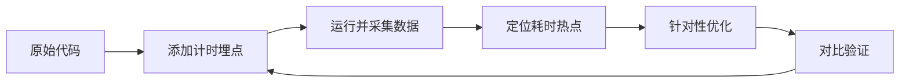

# 代码段运行时间统计

> 精准测量 Python 代码段执行时间的多种方法，重点关注低性能消耗的计时方案。

---

## 目录

1. [为什么需要性能计时](#1-为什么需要性能计时)
2. [Python 计时模块对比](#2-python-计时模块对比)
3. [推荐方案：`time.perf_counter`](#3-推荐方案timeperf_counter)
4. [进阶：`timeit` 模块](#4-进阶timeit-模块)
5. [装饰器封装](#5-装饰器封装)
6. [上下文管理器封装](#6-上下文管理器封装)
7. [实用示例](#7-实用示例)
8. [注意事项](#8-注意事项)

---

## 1. 为什么需要性能计时

在深度学习推理、图像处理、视频流分析等场景中，定位性能瓶颈至关重要：



**适用场景：**

- 对比不同推理后端（ONNX Runtime / TensorRT / OpenVINO）的延迟
- 衡量预处理（resize、normalize）耗时
- 评估后处理（NMS、解码）效率
- 监控视频流的 FPS

---

## 2. Python 计时模块对比

| 方案 | 精度 | 开销 | 适用场景 |
|------|------|------|----------|
| `time.time()` | ~1/60 s (Windows) | 低 | ❌ 不适合微秒级测量 |
| `time.perf_counter()` | **纳秒级** | **极低** | ✅ **通用首选** |
| `time.perf_counter_ns()` | 纳秒级 | 极低 | ✅ 需要整数纳秒时 |
| `time.monotonic()` | 同 perf_counter | 低 | ✅ 避免系统时间调整影响 |
| `timeit.default_timer()` | 同 perf_counter | 极低 | ✅ timeit 内部计时器 |
| `time.process_time()` | 高 | 中 | ⚠️ 仅 CPU 时间，不含 sleep |
| `timeit` 模块 | 自动多次取均值 | 较高 | ✅ 微基准测试 |
| `cProfile` / `py-spy` | 函数级 | 高 | ❌ 性能分析（非计时） |

> **核心结论：** 日常代码段计时首选 `time.perf_counter()`，其提供纳秒级精度且性能开销极小（约几十纳秒级别）。

---

## 3. 推荐方案：`time.perf_counter`

### 3.1 基本用法

```python
import time

# 开始计时
t_start = time.perf_counter()

# ---------- 被测代码段 ----------
result = some_heavy_function()
# --------------------------------

# 结束计时
t_end = time.perf_counter()

elapsed = t_end - t_start          # 秒 (float)
elapsed_ms = elapsed * 1000        # 毫秒
elapsed_us = elapsed * 1_000_000   # 微秒

print(f"耗时: {elapsed_ms:.2f} ms")
```

### 3.2 使用 `perf_counter_ns` 避免浮点误差

```python
t_start = time.perf_counter_ns()
result = some_heavy_function()
t_end = time.perf_counter_ns()

elapsed_ns = t_end - t_start
print(f"耗时: {elapsed_ns / 1_000_000:.2f} ms")
```

### 3.3 统计多次运行

```python
import time
import statistics

def benchmark(func, *args, repeats=100, **kwargs):
    """运行多次并统计最小值 / 均值 / 中位数。"""
    times = []
    for _ in range(repeats):
        t0 = time.perf_counter()
        func(*args, **kwargs)
        t1 = time.perf_counter()
        times.append(t1 - t0)

    print(f"执行 {repeats} 次:")
    print(f"  最小值: {min(times) * 1000:.3f} ms")
    print(f"  中位数: {statistics.median(times) * 1000:.3f} ms")
    print(f"  平均值: {statistics.mean(times) * 1000:.3f} ms")
    print(f"  标准差: {statistics.stdev(times) * 1000:.3f} ms")
```

---

## 4. 进阶：`timeit` 模块

`timeit` 自动处理垃圾回收、多次运行取均值，适合微基准测试。

### 4.1 命令行使用

```bash
python -m timeit -n 100 -s "import numpy as np" "np.zeros((640, 480))"
```

### 4.2 脚本内使用

```python
import timeit

# 单次测量（使用默认计时器，即 perf_counter）
t = timeit.timeit(
    "np.zeros((640, 480))",
    setup="import numpy as np",
    number=1000
)
print(f"总耗时: {t:.4f} s")
print(f"平均耗时: {t / 1000 * 1000:.4f} ms")
```

### 4.3 `default_timer` —— 最轻量的 timeit 入口

```python
from timeit import default_timer

t0 = default_timer()
# 被测代码
t1 = default_timer()
print(f"{t1 - t0:.6f} s")
```

> `timeit.default_timer` 在 Windows 上等价于 `time.perf_counter`，推荐作为统一入口。

---

## 5. 装饰器封装

将计时逻辑抽象为装饰器，一键测量任何函数的耗时：

```python
import functools
import time
from typing import Callable, Any

def timer(func: Callable) -> Callable:
    """打印函数执行时间的装饰器。"""
    @functools.wraps(func)
    def wrapper(*args, **kwargs) -> Any:
        t0 = time.perf_counter()
        result = func(*args, **kwargs)
        t1 = time.perf_counter()
        elapsed = (t1 - t0) * 1000
        print(f"[{func.__name__}] 耗时: {elapsed:.2f} ms")
        return result
    return wrapper

# 使用示例
@timer
def preprocess(image):
    # ... 预处理逻辑
    return processed
```

**进阶版 —— 带统计功能的装饰器：**

```python
import functools
import time
import statistics

class TimerStats:
    """累计统计装饰器。"""
    def __init__(self, func):
        functools.update_wrapper(self, func)
        self.func = func
        self.times = []

    def __call__(self, *args, **kwargs):
        t0 = time.perf_counter()
        result = self.func(*args, **kwargs)
        t1 = time.perf_counter()
        self.times.append(t1 - t0)
        return result

    def report(self):
        if not self.times:
            print("无数据")
            return
        print(f"[{self.func.__name__}] 调用 {len(self.times)} 次:")
        print(f"  均值: {statistics.mean(self.times) * 1000:.2f} ms")
        print(f"  中位数: {statistics.median(self.times) * 1000:.2f} ms")
        print(f"  最小值: {min(self.times) * 1000:.2f} ms")
        print(f"  最大值: {max(self.times) * 1000:.2f} ms")

@TimerStats
def process_frame(frame):
    # 处理单帧
    pass

# 在循环中使用
for frame in video_stream:
    process_frame(frame)

# 最后输出统计
process_frame.report()
```

---

## 6. 上下文管理器封装

使用 `with` 语句，方便测量任意代码块的耗时：

```python
import time

class Timeit:
    """上下文管理器 —— 测量代码块执行时间。"""
    def __init__(self, name="Block"):
        self.name = name

    def __enter__(self):
        self.t0 = time.perf_counter()
        return self

    def __exit__(self, *args):
        self.elapsed = time.perf_counter() - self.t0
        print(f"[{self.name}] 耗时: {self.elapsed * 1000:.2f} ms")

# 使用示例
with Timeit("预处理"):
    img = cv2.resize(img, (640, 640))
    img = img.astype(np.float32) / 255.0

with Timeit("推理"):
    outputs = session.run(None, {input_name: img})
```

**支持嵌套和累计：**

```python
import time
from contextlib import contextmanager
from typing import List

@contextmanager
def timer(name: str, store: List[tuple] = None):
    """轻量计时上下文，支持外部存储结果。"""
    t0 = time.perf_counter()
    yield
    t1 = time.perf_counter()
    elapsed = (t1 - t0) * 1000
    print(f"[{name}] {elapsed:.2f} ms")
    if store is not None:
        store.append((name, elapsed))

# 使用示例
records = []
with timer("resize", records):
    img = cv2.resize(img, (640, 640))
with timer("infer", records):
    outputs = session.run(None, {input_name: img})
```

---

## 7. 实用示例

### 7.1 测量推理管线各阶段耗时

```python
import time

def inference_pipeline(image):
    times = {}

    t0 = time.perf_counter()
    blob = preprocess(image)                     # 预处理
    times["preprocess"] = time.perf_counter() - t0

    t0 = time.perf_counter()
    outputs = ort_session.run(None, {"images": blob})  # 推理
    times["inference"] = time.perf_counter() - t0

    t0 = time.perf_counter()
    boxes = postprocess(outputs)                 # 后处理
    times["postprocess"] = time.perf_counter() - t0

    # 总耗时
    total = sum(times.values())
    for k, v in times.items():
        print(f"  {k:12s}: {v * 1000:7.2f} ms ({v / total * 100:5.1f}%)")
    print(f"  {'总计':12s}: {total * 1000:7.2f} ms")

    return boxes
```

### 7.2 视频流 FPS 统计

```python
import time
import cv2

cap = cv2.VideoCapture(0)   # 或视频文件 / RTSP 流

fps_times = []
while True:
    t0 = time.perf_counter()
    ret, frame = cap.read()
    if not ret:
        break

    # 在此处添加推理等处理 ...

    t1 = time.perf_counter()
    fps_times.append(t1 - t0)

    # 每 30 帧输出一次实时 FPS
    if len(fps_times) >= 30:
        avg_time = sum(fps_times) / len(fps_times)
        print(f"FPS: {1 / avg_time:.1f}")
        fps_times.clear()

    if cv2.waitKey(1) & 0xFF == ord('q'):
        break

cap.release()
```

---

## 8. 注意事项

1. **避免首次运行偏差**：Python 函数的第一次调用可能包含编译/加载开销，应丢弃前几次的结果或预热。
2. **系统负载影响**：后台进程、CPU 频率缩放会影响测量结果，建议多次取最小值而非平均值。
3. **`time.time()` 不适用于计时**：`time.time()` 受系统时间调整（NTP、手动修改）影响，且 Windows 精度仅约 16 ms。
4. **`perf_counter` vs `monotonic`**：`perf_counter` 包含 sleep 时间（墙上时钟），`monotonic` 仅保证单调递增。测量 IO/网络等阻塞操作应使用 `perf_counter`。
5. **多线程/多进程**：`perf_counter` 是进程级别的，在不同进程间不可直接比较。
6. **GPU 异步操作**：如果使用 CUDA 等 GPU 后端，`time.perf_counter()` **仅测量 CPU 端耗时**。需要调用 `cudaEventSynchronize()` 或对应后端的同步 API 才能获得真实 GPU 耗时。

   ```python
   # PyTorch CUDA 同步示例
   torch.cuda.synchronize()
   t0 = time.perf_counter()
   output = model(input)
   torch.cuda.synchronize()
   t1 = time.perf_counter()
   ```

7. **开销对比参考**（单次调用开销）：

   | 操作 | 耗时 |
   |------|------|
   | `time.perf_counter()` | ~50 ns |
   | `time.time()` | ~100 ns |
   | `timeit.default_timer()` | ~50 ns |
   | `datetime.now()` | ~300 ns |

---

> **总结：日常开发中，使用 `time.perf_counter()` 配合上下文管理器或装饰器，即可获得足够精确且低开销的计时能力。**
